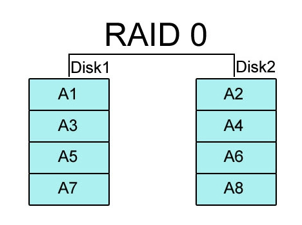
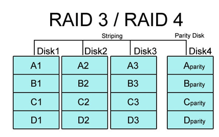
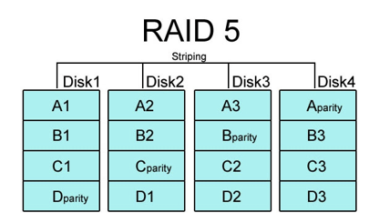
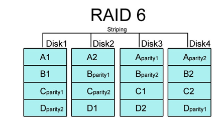

- [RAID](#raid)
  + [RAID의 뜻](#raid---)
  + [RAID 는 왜 쓸까?](#raid--------)
  + [RAID 에서 쓰이는 3가지 기술](#--raid--------3-------)
    - [1.스트라이핑](#스트라이핑)
    - [2.미러링](#미러링)
    - [3.패리티](#패리티)
  * [RAID 종류와 특징](#RAID-종류와-특징)
    + [1. RAID - 0](#1-raid---0)
    + [2. RAID - 1](#2-raid---1)
    + [3. RAID - 2](#3-raid---2)
    + [4. RAID - 3](#4-raid---3)
    + [5. RAID - 4](#5-raid---4)
    + [6. RAID - 5](#6-raid---5)
    + [7. RAID - 6](#7-raid---6)
  + [정리](#정리)
  + [결론](#결론)

# RAID

### RAID의 뜻

가격이 좀 더 싸고, 용량이 작은 디스크들을 묶어서 하나인 것처럼 사용할 수 있는 기억 장치입니다.  
Redundant Array of Inexpensive (Independent) Disks 라고 하네요.  
말 그대로 싼 디스크들을 배열 구조로 연결했다고 생각하면 이해하기 편한 것 같습니다.  
근데 요즘에는 디스크 가격이 싸져서 Inexpensive 대신에 Independent 라고도 불립니다.  

### RAID 는 왜 쓸까?

`디스크 액세스 시간을 빠르게 하기 위해서 씁니다`. 디스크를 배열 구조로 연결하면 용량은 늘리고, 액세스 속도를 크게 향상시킬 수 있기 때문입니다.  
데이터의 안정성 때문에 쓰는건 아닙니다.

### **RAID 에서 쓰이는 3가지 기술**

#### 1. 스트라이핑

데이터를 여러 조각으로 분할해서, 여러 디스크들에 분산해서 저장하는 기술입니다.

 

#### 2.미러링

하나의 데이터를 디스크 2개에 중복 저장하는 방식입니다.

**왜 중복 저장을 할까요 ?**  
동일한 데이터를 2개에 저장함으로써 데이터의 안정성을 좀 더 강화시키기 위해서 입니다.

**단점은 없을까요 ?**  
네, 단점은 데이터의 중복 저장으로 용량 낭비가 심하다는 단점이 있습니다.

> RAID 1을 단순한 예시로 들자면, 하나의 디스크가 갑자기 고장나도 정상 동작하는 디스크가 남아있으므로 고장난 디스크만 교체해 주면 서버 정지 없이도 원상 복구가 가능합니다.
> 한편, 하나의 디스크가 바이러스나 랜섬웨어에 감염이 되는 경우에는 나머지 디스크에도 모조리 그 감염된 데이터가 기록되게 됩니다.
> RAID는 이렇듯이 데이터의 무결성/안전을 보장해주는 기술이 아니기 때문에 초대형 서버의 경우에도 RAID 외에 별도로 미러링 서버나 자기 테이프 등 별도의 데이터 백업 솔루션을 마련해 둔다고 합니다.

 

#### 3.패리티

데이터의 무결성을 확인하는 기술입니다. 패리티 비트 생각해보시면 됩니다.
데이터의 장애가 생기면, 저장된 패리티를 이용해서 데이터를 복구할 수 있습니다.
복구 방법은 아래 링크를 참고해서 읽어보시면 됩니다.  
[RAID5 복구방법](https://dev-box.tistory.com/70 "RAID5 복구방법")

 

## RAID 종류와 특징

### 1. RAID - 0

배열 내 모든 물리 디스크에 데이터를 나누어 저장하는 방식이라서 스트라이핑을 사용한 방식입니다.  
모든 데이터는 한 개의 논리 디스크에 저장된 것처럼 보이지만, 물리 디스크의 블록(섹터나 페이지) 으로 나뉘게 됩니다.  
그리고 블록은 각 디스크에 라운드-로빈 방식으로 저장됩니다. (운영체제에서 배운 라운드-로빈 맞습니다.)  

#### 장점

액세스 속도와 데이터 전송 속도를 높일 수 있습니다.  
파일 하나를 여러 개의 디스크에 분산하여 저장하면, 각 블록을 동시에 읽거나, 동시에 쓸 수 있어서 속도가 빨라지겠죠?  
또 하나의 장점은  
디스크 하나에 데이터 액세스가 집중되지 않아서 병목 현상도 줄일 수 있습니다.  

#### 단점

디스크 하나라도 결함이 발생했다고 가정하겠습니다.

위의 그림에서 A3 하나라도 없어지면, A1 A2 를 읽고나서, 다음에 읽으려는 A3 데이터가 없어지니까 해당 데이터의 신뢰가 낮아지게 됩니다.  
그래서, 고장이 나더라도 신뢰성 있는 데이터를 보장하기 위해서 RAID - 1 은 미러링 기술을 사용했고 ,   
RAID - 2,3,4,5,6 은 패리티를 사용하게 되었습니다.  

 

### 2. RAID - 1

미러링을 사용하는 방식입니다.  
디스크가 8개 있다고 하면,  그 중 4개를 데이터 디스크(Disk1) 로 사용하고, 나머지 4개를 미러 디스크(Disk2) 로 사용합니다.  
미러 디스크에도 저장이 되니까, 데이터에 대한 신뢰성이 높아지게 될 것입니다.  
예를 들어, 데이터 디스크에 저장된 A1 에 오류가 발생해도, 디스크2에서 A1 이 있기 때문에 복구가 가능합니다.  

#### 장점

당연히 장점은 신뢰성이 높다는 것입니다.

#### 단점

당연히 단점은 가격이 비싸다는 것입니다. 사용 가능한 용량이 전체 디스크의 반으로 줄기 때문이라고 생각하시면 됩니다.  
또한, 쓰기 동작을 항상 디스크 2개에 동시에 수행해야 하기 때문에, 두 디스크 중에서 쓰기 시간이 다른 느린 디스크에서 쓰기가 완료될 때까지 쓰기 작업이 완료되진 않습니다. (쓰기 동작이 느려질 수도 있다는 뜻입니다.)  
그래서, RAID-1 은 시스템 소프트웨어나 중요한 파일을 저장하는 용도로만 사용됩니다.

  

### 3. RAID - 2

스트라이핑 기술을 사용하는 방식입니다.  
각 디스크에는 **바이트 단위 또는 워드 단위**로 저장이 됩니다. (매우 작다는 뜻입니다.)  
또한, 데이터 디스크와 검사 디스크로 구성이 되어있습니다.

> 만약, 디스크 수를 G 라고 하면, 최소로 필요한 검사 디스크 수 C 는 다음 식에 의해 결정된다고 합니다.  
> 
> 

> 만약 G 가  8 이라면, C는 몇 개가 필요할 까요?  
> C가 3이라면,  8 >= 8 + 3 + 1 을 만족하지 않고,  
> C가 4이라면, 16 >= 8 + 4 + 1 을 만족하니까, 4개는 필요하겠네요!

#### 장점

RAID - 2는 1비트 오류가 발생하면 검출도 하고, 수정도 가능합니다.  
하지만, RAID - 2에선 2비트 오류는 검출만 가능하다는 것 참고하시면 될 것 같습니다.  
그리고, 검사 디스크는 오류 검출 방식으로 해밍 코드 방식을 사용합니다. 해밍 코드 방식에도 패리티가 들어갑니다.  
해밍 코드 방식에 대한 자세한 내용은 더 공부하시거나 링크를 참고하시면 됩니다.  
[해밍코드 방식 링크](https://m.blog.naver.com/PostView.naver?isHttpsRedirect=true&blogId=deepb1ue&logNo=221189953315)

#### 단점

RAID-2 는 RAID-1 ( 미러링 디스크 사용) 보다는 디스크가 적게 필요하지만, 비싸다고 합니다. 복잡하고 비용이 높아서 잘 사용안한다고 합니다.  
또한, 검사 디스크가 손상이 된다고 하면, 문제가 발생할 것입니다.  

 
 

### 4. RAID - 3

그림 설명 : RAID - 2 처럼 검사디스크의 개수가 여러개가 아니라 패리티 디스크 하나만 있으면 됩니다.

데이터는 스트라이핑 되어 모든 데이터 디스크에 분산처리 되는 방식입니다.  
데이터는 바이트 단위로 나눈다고 합니다. (이 부분이 RAID-4와의 차이점입니다.)  
그리고, 오류 검출 및 수정 방식은 해밍 코드 방식 대신에 패리티 방식을 이용합니다.  
[패리티 방식에 대한 설명 링크](https://m.blog.naver.com/PostView.naver?isHttpsRedirect=true&blogId=deepb1ue&logNo=221189953315)

#### 장점

디스크에서 병렬로 데이터 처리가 가능하여, 액세스 속도가 높습니다. (RAID - 0 과 동일한 장점)
오류 검출 및 수정이 가능하다는 점도 장점이 되네요.

#### 단점

쓰기 작업때 마다, 패리티 디스크에 두 번씩 액세스되어 패리티 디스크에 병목 현상이 발생하는 문제가 있습니다.  
(원래 패리티 읽을때 때 1번 + 갱신한 패리티 쓸 때 1번)  

 
 

### 5. RAID - 4

스트라이핑을 이용한 방식입니다.

데이터는 각 디스크에 블록 단위로 나누어져 있고, 상대적으로 데이터의 저장 단위가 커서 데이터가 디스크 하나에만 저장되어있으니,  여러 개의 액세스 요구를 동시 처리가 가능합니다.  
(디스크에 저장하는 저장 단위가 너무 작게 되면 각 디스크들을 다 읽어야 원하는 데이터 블록을 읽을 수 있으니까, 액세스 요구를 동시에 처리하기에는 힘들 것입니다.)  

> 만약, 위 이야기가 이해가 되지 않는다면 읽어보세요.

> 예를 들면, 저장해야 하는 파일(A)의 용량이 10인데, 디스크는 10개가 존재한다고 가정합시다.  
> 이때, 데이터의 저장 단위가 1인 경우와 10인 경우를 생각해봅시다.
>
> 데이터의 저장 단위가 1라면, A의 파일은 디스크 10개로 나뉘어 저장될 것입니다.  
> (읽기 10번 해야됨) -> 다른 액세스 요구를 처리할 수가 없음
>
> 데이터의 저장 단위가 10이라면 A의 파일은 디스크 1개에만 저장될 것입니다.  
> (읽기 1번만 하면 됨) -> 9개의 디스크가 여유가 있으므로 다른 액세스 요구 처리 가능

#### 장점

다양한 액세스 요구에 대한 동시 처리가 가능하다. (빠르다는 겁니다.)

#### 단점 (RAID-3 의 단점과 동일합니다.)

쓰기 작업때 마다, 패리티 디스크에 두 번씩 액세스되어 패리티 디스크에 병목 현상이 발생하는 문제가 있습니다.  
(원래 패리티 읽을때 때 1번 + 갱신한 패리티 쓸 때 1번)

 
 

### 6. RAID - 5

RAID- 4 의 단점을 보완하기 위해 나온 방식입니다.  
모든 디스크는 블록 단위로 스트라이핑 되어 저장이 됩니다.  
RAID-4  와의 차이점은 패리티 블록도 모두 데이터 디스크에 분산하여 저장하는 것입니다.  
분산할 때는 라운드-로빈 방식을 이용한다고 하네요.  

 

#### 장점

그래서 , 가장 중요한 장점은 다양한 액세스 요구에 대한 동시 처리(스트라이핑) 도 되면서, 패리티 디스크에 대한 병목 현상이 완화(패리티 블록을 분산 저장해서) 된다는 뜻입니다.  

**왜 완화가 되나요?**  
원래 RAID-4 에서는 매번 패리티 디스크에 두 번씩 액세스를 해야했는데,  
RAID-5 에서는 각 디스크에 패리티 블록이 있으니까 각 디스크에서만 액세스하면 되니까요.

**그래서, 성능이 좋아 현재 널리 사용되는 방식이라고 합니다.**  

#### 단점

디스크 2개에서 오류가 발생할 경우에는 복구가 안된다고 합니다.  

 
 

### 7. RAID - 6

스트라이핑 방식이고, RAID - 5와 다른건 딱 하나입니다.

바로, 패리티 블록을 2개 사용한다는 점입니다.

  

위의 그림에서, A1, A2, Aparity1, Aparity2 부분을 보시면,  
parity1은 홀수 패리티로 사용하고, parity2는 짝수 패리티로 사용하여 패리티 블록 2개를 사용하는 것을 확인할 수 있습니다.

#### 장점

RAID-6 은 패리티블록 2개를 사용했기 때문에, 디스크 2개에서 오류가 발생하더라도 복구가 가능합니다.

#### 단점

RAID-6 은 쓰기 동작을 수행할 때마다 패리티 블록 2개를 갱신해야하니까 쓰기작업에서는 RAID - 5 보다는 느립니다.  

---

### 정리

- RAID - 0 은 성능을 추구
- RAID - 1 은 안정성을 극단적으로 추구
- RAID - 2, 3, 4 는 성능 향상을 위해 실제 데이터 저장은 RAID - 0 방식을 쓰고, 여기에 데이터 복구를 위한 데이터가 추가된 형태
  - RAID - 2는 데이터 복구를 위해 해밍 코드 방식 이용
  - RAID -3, RAID - 4는 패리티 코드를 이용
- RAID-5, RAID -6 은 각 디스크에 데이터를 분산 저장해서 성능도 빠르고, 데이터 복구를 위한 패리티 블록을 분산 저장해서 안정성을 높인 방식
  - RAID - 5는 디스크 1개 문제 생길 경우 복구 가능 , 2개는 안됨
  - RAID - 6은 디스크 2개 문제 생겨도 복구 가능하지만, 복잡한 연산이 필요해서 일반적으로 사용하지 않음

### 결론

요즘에는 `안정성을 추구하는 RAID-1` 과 `비용과 안정성이 조화로운 RAID-5`가 서버데이터 저장 방식으로 많이 사용된다고 합니다.
