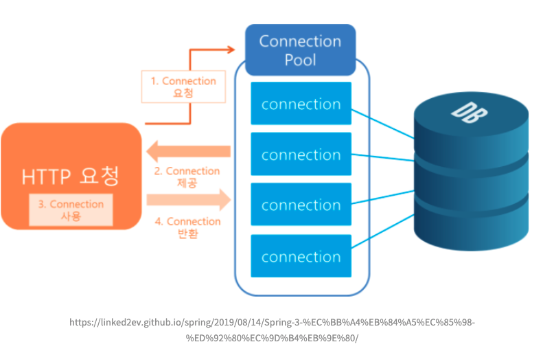
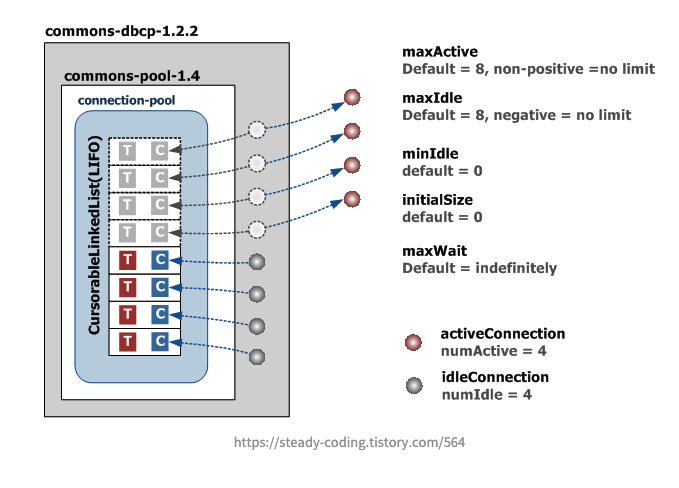
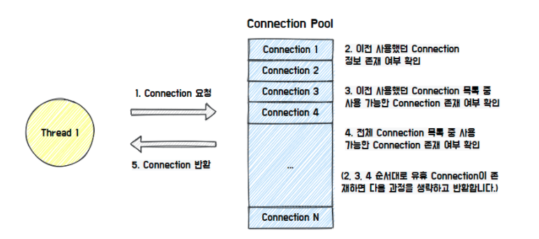
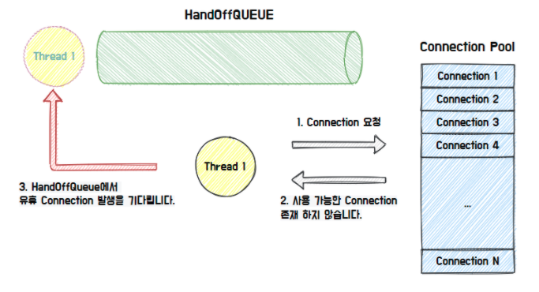
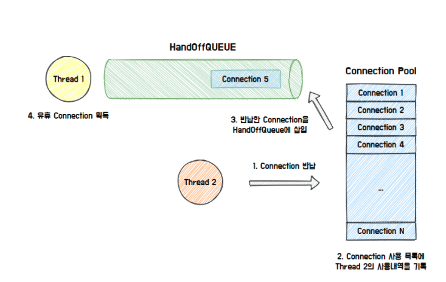

## 커넥션 풀 (DBCP; Database Polling Service)

웹 컨테이너(WAS)가 실행되면서 Database와 연결된 Connection을 미리 생성하여 pool에 저장해두었다가, 클라이언트의 요청이 오면 해당 Connection 을 사용하고, 처리가 끝나면 다시 반환했던 Connection을 반납받아 pool에 저장하는 방식이다.

 

> Connection   
> 데이터베이스 서버에 연결하기 위해 사용되는 객체로, Connetion이 생성될 때마다 시스템의 자원(CPU, 메모리)의 많은 소모와 시간이 발생한다.

1) Connection 요청 발생     
2) Connection Pool에 존재하는 Connection 을 제공    
3) Connection 사용    
4) Connection 사용 종료   
5) 사용이 끝난 Connection 을 다시 Connection Pool 에 반환    

 
 

## 커넥션 풀 개수 설정

| 옵션 | 설명 |
| --- | --- |
| maxActive | 동시에 사용할 수 있는 최대 커넥션 개수 |
| maxIdle | Connection Pool에 반납할 때 최대로 유지될 수 있는 커넥션 개수 |
| minIdle | 최소한으로 유지할 커넥션 개수 |
| initialSize | 최초로 getConnection() Method를 통해 커넥션 풀에 채워 넣을 커넥션 개수 |
| maxWait | 커넥션을 얻기 전 최대 대기 시간 |

 

1) macActive 는 initialSize 보다 더 크거나 같아야한다.
2) maxActive 와 maxIdle 은 동일하게 설정하는 것을 권장한다.

 

( 2)번 예시 상황 )
> maxActive = 10이고, maxIdle = 5인 경우

동시에 사용할 수 있는 최대 커넥션 개수가 10개인데, 항상 커넥션을 동시에 5개를 사용하고 있다고 가정하자. 이때 1개의 커넥션이 추가로 요청된다면 10개까지 가능하므로 하나의 Connection을 생성하여 추가하고, 이 Connection은 요청이 끝난 후 다시 pool에 보관된다. 이때 maxIdel이 5이므로 해당 커넥션은 close 되어, 이런 상황이 반복되면 매번 Connection을 생성하고 닫는 비용이 발생할 수 있다.

 

 
 

## 커넥션 풀 동작원리 (예시: Hikari CP)

(예시) Hikari CP : [https://brunch.co.kr/@jehovah/24](https://brunch.co.kr/@jehovah/24)

Connection Pool을 관리해주는 라이브러리

 
(1번)    

 
- 요청이 발생하여, Connection Pool의 Connection 을 반환한다. 이전에 사용했던 Connection의 존재 여부를 확인하여 이를 우선적으로 반환한다.

 
(2번)

 
- 가능한 Connection이 존재하지 않을 경우, HandOffQueue를 Polling 하면서 다른 Thread가 Connection을 반납하기를 기다린다. 만약 최대 대기시간 설정값 (maxWait)보다 지나게되면 예외가 발생한다.

> Polling
> 주기적으로 Connection Pool의 상태를 검사하여 HandOffQueue에 동기화한다.

 
(3번)

- 최종적으로 사용한 Connection을 반납하면 Connection Pool이 Connection 사용 내역을 기록하고 HandOffQueue에 반납된 Connection을 삽입한다.

 
 

## 커넥션 풀의 장점

> ** 만약 커넥션풀을 사용하지 않는다면?  
> 클라이언트의 요청이 발생할때 마다 Connection 을 생성해줘야하는 상황이라고 가정해보자. 이렇게되면 요청이 올때마다 계속해서 새로운 Connection 객체가 생성되며, Conenction을 생성하고 삭제하는 비용이 발생하게된다.

1) 커넥션 풀에 미리 Connection 들을 생성하여 저장하므로, 커넥션이 필요한 시점에 생성하는 시간을 소비하지 않는다.
2) 생성된 Connection을 계속해서 재사용하여, 생성되는 커넥션의 수가 많지 않고 직접 설정이 가능하다.

 
 

### Reference.

[https://programmer93.tistory.com/74](https://programmer93.tistory.com/74)

[https://linked2ev.github.io/spring/2019/08/14/Spring-3-%EC%BB%A4%EB%84%A5%EC%85%98-%ED%92%80%EC%9D%B4%EB%9E%80/](https://linked2ev.github.io/spring/2019/08/14/Spring-3-%EC%BB%A4%EB%84%A5%EC%85%98-%ED%92%80%EC%9D%B4%EB%9E%80/)

[https://velog.io/@kchief/Connection-Pool%EC%BB%A4%EB%84%A5%EC%85%98-%ED%92%80](https://velog.io/@kchief/Connection-Pool%EC%BB%A4%EB%84%A5%EC%85%98-%ED%92%80)

[https://steady-coding.tistory.com/564](https://steady-coding.tistory.com/564)