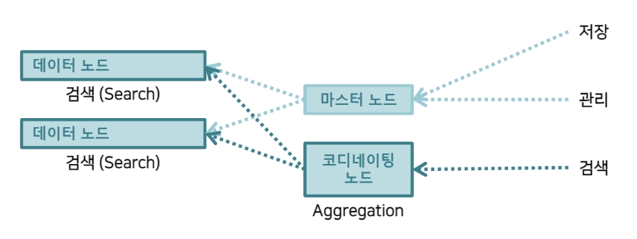
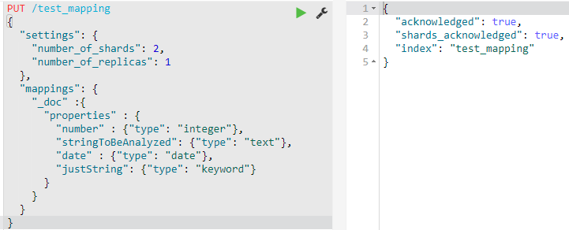
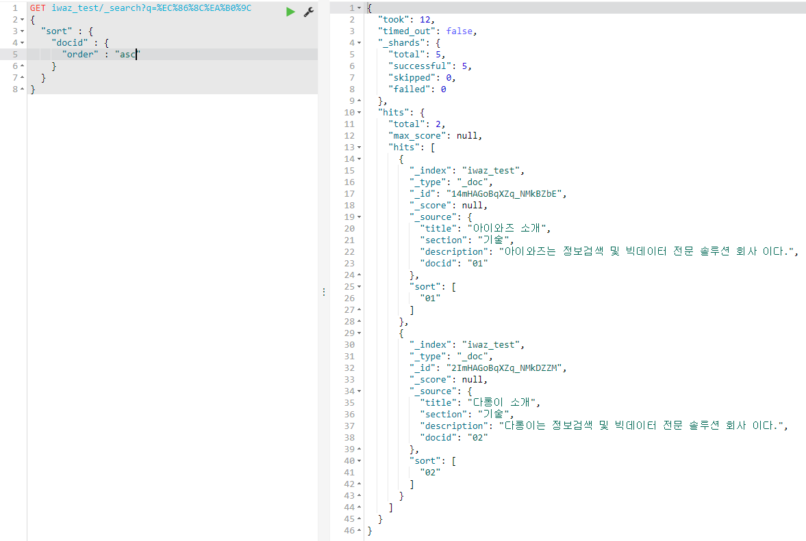

## Elasticsearch란?
아파치 루씬 기반의 java 오픈소스 분산 검색엔진이다.  
방대한 양의 데이터를 신속하고 거의 실시간으로 저장, 검색, 분석할 수 있다.

> 검색엔진의 시초, Lucene  
> 더그커팅이 고안한 역색인 구조인 아파치 루씬을 기반으로 분산처리를 가능하게한 아파치 솔라가 등장해서 검색엔진 시장을 장악했고, 
> 몇년 후에 역시 루씬을 기반으로 한 엘라스틱서치가 등장해 지금은 검색엔진 분야에서 지배적인 위치에 있다.

<br>

## 검색엔진? 검색시스템? 검색서비스?

- 검색엔진  
    광할한 웹에서 정보를 수집해 검색 결과를 제공하는 프로그램이다.  
  
- 검색시스템  
    대용량 데이터를 기반으로 신뢰성있는 검색 결과를 제공하기 위해 검색엔진을 기반으로 구축된 시스템을 통칭하는 용어이다.
  
- 검색서비스  
    검색엔진을 기반으로 구축한 검색 시스템을 활용해 검색결과를 서비스로 제공한다.

엘라스틱서치는 엄밀히 말하자면 검색엔진이며 아래에서는 검색 서비스를 제공하기 위해 엘라스틱서치를 이용해 검색 시스템을 구축하는 것을 보겠다.
  
> 검색서비스 > 검색시스템 > 검색엔진


  

<br>

## 검색시스템 구성요소


- 수집기  
    수집기는 웹사이트, 블로그, 카페 등 웹에서 필요한 정보를 수집하는 프로그램이다.  
  크롤러, 스파이더, 웜, 웹 로봇 등으로 불린다.
  
- 저장소  
    색인기가 색인한 데이터를 보관하는 물리적 저장소
  
- 색인기  
    수집기가 수집한 데이터를 검색 가능한 구조로 가공해서 저장  
  형태소 분석기를 통해 유의미한 단어를 추출하고 검색에 유리한 역색인 구조로 데이터를 저장
  
- 검색기  
    저장된 문서중 사용자 질의와 일치하는 결과를 역색인 구조를 통해 찾아서 반환  
  유사도 기반의 검색 순위 알고리즘으로 사용자 질의와 문서가 일치하는지 판단
  
<br>

## 색인과 역색인 이란??

색인이란 특정한 데이터가 어느 위치에 있는지 미리 저장해두어 검색 시에 빠른 속도로 찾을 수 있다.  
이를테면 '나는 홍길동 입니다. 나는 아버지를 아버지라 부르지 못 합니다.' 라는 문자열 데이터가 있는 경우에 다음과 같이 색인될 수 있다.
```
1. 나는 홍길동 입니다.
2. 나는 아버지를 아버지라 부르지 못합니다.
```
위와 같이 색인이 된 경우에 내가 만일 '홍길동'이란 단어가 들어간 데이터를 찾는다고 검색하면 색인결과에 따라 1번 데이터에
내가 원하는 데이터가 있다는 결과가 나올 수 있다.  

하지만 이 방법에는 문제가 있다. 적은 데이터 일때는 상관없지만 데이터가 매우 많다면  
1번부터 끝 데이터까지 순서대로 검색하여 '홍길동'이란 단어를 찾기 때문에 엄청난 속도지연이 발생할 수 있다.  

이러한 현상을 개선하기 위해서 역색인이 필요하다.  

역색인이란 데이터 색인 시에 조금 더 인간의 사고와 가깝게 체계를 구성한 것이다.  
어떠한 데이터를 색인할 때 Term(단어) 기준으로 색인을 수행하는 것이다.  
위의 예제를 역색인 한다면 다음과 같다.
```
나 #1, 2
는 #1, 2
홍길동 #1
입니다 #1
아버지 #2
를 #2
부르지 #2
못 #2
합니다 #2
```
이렇게 역색인된 데이터가 구성되어있다면 홍길동이라는 단어를 보고 바로 1번 문서에 있다는 것을 알 수 있다.

<br>

## 검색기 형태소 분석
위에 검색기는 색인된 단어를 검색한다고 했다. 그런데 우리는 검색 시에 보통 단어만 입력하는 경우는 없다.  
보통 문장을 통째로 검색하는데 만일 그 문장이 통째로 검색이 된다면 일치하는 검색결과를 찾기 매우 어려울 것이다.  

그래서 검색기는 검색하는 단어의 형태소를 분석한다. `검색 잘하는 방법`을 입력하면 밑에 처럼 나눠지게 된다.
```
검색
잘하는
방법
```
검색, 잘하는, 방법을 하나씩 역색인을 보고 찾아 문서가 몇번째에 있는지 알려준다.

<br>

## 검색기 품질
여기서 품질이란 내가 원하는 검색결과가 나왔는지, 엉뚱한 것이 검색결과로 나타나는지 등으로 평가할 수 있다.

검색엔진의 품질을 높이기 위한 방법으로 여러가지 방법이 있다.
- 유사도 기반 검색 : 검색어와 키워드들간의 유사도를 축정하여 상위 노출
- 인기도 기반 검색 : 자주 검색하는 결과를 상위 노출
- 오타 수정 : 검색어를 분석하여 의미있는 단어로 수정하여 검색 (또는 추천)
- 신뢰도 기반 검색 : 신뢰도 있는 사이트 상위 노출 (단어 검색시 사전을 상위 노출)
- 검색결과 내 재검색 : 검색된 결과 범위 내에서 재검색

등등이 있는데 유사도 기반 검색만 살펴보겠다.

<br>

유사도 기반 검색이란 단순히 매칭된 결과만 보여주는 것이 아닌 유사성을 띈 결과를 보여주어야 한다.

TF-IDF가 높은 단어들끼리 묶으면 유사도가 높다고 판단

- TF(Term Frequency)  
    특정 단어가 문서 내에 얼마나 자주 등장하는지, 높을수록 문서에서 중요
  
- IDF(Inverse Document Frequency)  
    특정 단어가 전체 문서에서 얼마나 자주 등장하는지의 역수
  
- TF-IDF  
    특정 단어가 해당 문서에 자주 나타나고 전체 중에서는 적게 나타난다.  
  => 해당 문서와 연관도가 높다
  


<br>

## 관계형 데이터베이스와의 차이점

검색엔진을 설명할 때 항상 비교되는 것이 관계형 데이터베이스(RDBMS)다.  
두 가지 모두 질의와 일치하는 데이터를 찾아 사용자에게 제공한다는 점에서 유사점이 많기 때문이다.

하지만 RDBMS로 검색기능을 제공하는데는 많은 문제점이 있다.  
RDBMS는 모든 데이터는 중복을 제거하고 정형 데이터로 구조화해 행과 열로 구성된 테이블에 저장된다.  


그리고 SQL문을 이용해 원하는 정보의 검색이 가능한데 텍스트 매칭을 통한 단순한 검색만 가능하다.  
텍스트를 여러 단어로 변형하거나 여러 개의 동의어나 유의어를 활용한 검색은 불가능하다.  


반면 검색엔진은 데이터베이스에서는 불가능한 비정형 데이터를 색인하고 검색할 수 있다.  
형태소 분석을 통해 사람이 구사하는 자연어의 처리가 가능해지고 역색인 구조를 바탕으로 빠른 검색 속도를 보장한다.

- 엘라스틱서치와 관계형 데이터베이스 비교

| 엘라스틱서치 | 관계형 데이터베이스 |
| --- | --- |
| 인덱스 | 데이터베이스 | 
| 샤드 | 파티션 | 
| 타입 | 테이블 | 
| 문서 | 행 |
| 필드 | 열 |
| 매핑 | 스키마 |
| Query DSL | SQL |

<br>

- 엘라스틱서치와 데이터베이스의 추가,수정,삭제 방식 차이

| 엘라스틱서치 HTTP 메서드 | 기능 | 데이터베이스 질의 문법 |
| --- | --- | --- |
| GET | 데이터 조회 | SELECT |
| PUT | 데이터 생성 | INSERT |
| POST | 인덱스 업데이트, 데이터 조회 | UPDATE, SELECT |
| DELETE | 데이터 삭제 | DELETE |
| HEAD | 인덱스의 정보 확인 | - |

<br>

## 엘라스틱서치의 장점

### 오픈소스 검색엔진
루씬을 기반으로 개발된 오픈소스 검색엔진이다. 따라서 전 세계에서 수많은 사람들이 사용하고 있으며, 버그가 발생할 경우 대부분 빠르게 해결된다.

### 전문 검색
PostgreSQL, MongoDB같은 대부분의 데이터베이스는 기본 쿼리 및 색인 구조의 한계로 인해 기본적인 텍스트 검색 기능만 제공한다.  
하지만 엘라스틱서치는 좀 더 고차원적인 전문검색(Full Text)이 가능하다.  
전문검색이란 내용 전체를 색인해서 특정 단어가 포함된 문서를 검색하는 것을 말한다. 기존 관계형데이터베이스는 전문검색에 적합하지 않지만
엘라스틱서치는 다양한 기능별, 언어별 플러그인을 조합해 빠르게 검색할 수 있다.

### 통계분석
비정형 로그 데이터를 수집하고 한곳에 모아 통계 분석을 할 수 있다.  
엘라스틱서치와 키바나를 연결하면 실시간으로 쌓이는 로그를 시각화하고 분석할 수 있다.

### 스키마리스
데이터베이스는 스키마라는 구조에 따라 데이터를 적합한 형태로 변경해서 저장하고 관리한다. 반면 엘라스틱서치는 정형화되지 않은
다양한 형태의 문서도 자동으로 색인하고 검색할 수 있다.

### RESTful API
엘라스틱서치는 HTTP 기반의 RESTful API를 지원하고 요청뿐 아니라 응답에도 JSON 형식을 사용해 시스템에 관계없이 이기종 플랫폼에서도 이용 가능하다.

### 멀티테넌시 (Multi-tenancy)
서로 상이한 인덱스일지라도 검색할 필드명만 같으면 여러개의 인덱스를 한번에 조회할 수 있다.  
이를 이용해 멀티테넌시 기능을 제공할 수 있다.

> 멀티테넌시  
> 하나의 소프트웨어나 인스턴스가 여러 사용자 혹은 사용자 그룹을 위해 작동하는 아키텍처라고 한다.  
> 참고 : https://sdesigner.tistory.com/119

### Document-Oriented
여러 계층의 데이터를 JSON 형식의 구조화된 문서로 인덱스에 저장 가능하다. 계층 구조로 문서도 한번의 쿼리로 쉽게 조회 가능하다.

### 역색인
MongoDB, 카산드라 같은 일반적인 NoSQL은 역색인을 지원하지 않는다.

### 확장성과 가용성
분산 시스템 구성으로 병렬적인 처리가 가능하다. 분산 환경에서는 데이터가 샤드(Shard) 단위로 나누어 제공된다.  
인덱스 생성시마다 샤드의 수 조정이 가능하다. 데이터의 종류와 성격에 따라 데이터를 분산하여 빠르게 처리 가능하다.

<br>

## 엘라스틱서치의 단점

### 실시간(Real Time) 처리는 불가능하다.
색인된 데이터는 1초 뒤에나 검색이 가능하다. 왜냐하면 색인된 데이터가 내부적으로 커밋(Commit)과 플러시(Flush)와 같은 과정을 거치기 때문이다.  
그래서 엘라스틱서치 공식 홈페이지에서도 NRT(Near Real Time)라는 표현을 쓴다.

> elasticsearch NRT, refresh  
> 참고 : https://m.blog.naver.com/PostView.naver?isHttpsRedirect=true&blogId=parkjy76&logNo=221062928230

### 트랜잭션(Transaction) 롤백(Rollback) 등의 기능을 제공하지 않는다.
분산 시스템 구성의 특징 때문에, 시스템적으로 비용 소모가 큰 롤백, 트랜잭션을 지원하지 않는다. 그래서 데이터 관리에 유의해야 한다.  
=> 보통 전에 사용하던 인덱스를 백업용으로 저장하고 있는다.

### 진정한 의미의 업데이트(Update)를 지원하지 않는다.
엘라스틱서치에는 물론 업데이트 명령이 있습니다만, 실제로는 데이터를 삭제했다가 다시 만드는 과정으로 업데이트된다.  
이러한 특성은 나중에 불변성(Immutable)이라는 이점을 제공하기도 한다.

<br>

## 엘라스틱서치 주요 용어


### Cluster
클러스터란 Elasticsearch에서 가장 큰 단위이다. 하나 이상의 노드로 이루어진 노드들의 집합이다.
클러스터는 독립적으로 서로 다른 클러스터에 접근을 할 수 없는 구조이다.  
여러 대의 서버가 하나의 클러스터를 구성할 수 있고, 한 서버에 여러개의 클러스터가 존재할 수 있어 사용자가 환경에 맞게 설정 할 수 있다.

### Node
노드는 클러스터를 이루는 요소이다. 
노드는 엘라스틱서치를 관계형 데이터베이스와는 다르게 만들어준다.  
관계형 데이터베이스는 하나의 서버에서 수직적으로 데이터가 커지는 반면, 여러개의 노드로 구성된 엘라스틱서치 서버는 어느정도 수평적으로 데이터가 커질 수 있다. 
이렇게 수평적으로 데이터가 커지는 특성은 엘라스틱서치가 대용량 데이터 처리를 할 수 있게 해준다.
  
노드에 종류는 여러가지가 있다.
- 마스터 노드 (Master Node)  
  클러스터 내에서 동작하는 노드들을 관리, 샤드 위치 정보 등을 포함
  

- 데이터 노드 (Data Node)  
  실제 데이터가 저장되는 노드 CRUD, 검색, 집계 연산등이 진행되기 때문에 자원을 많이사용한다.
  


- 코디네이팅 노드 (Coordinating Node)  
  검색시 데이터 노드에서는 search만 하고 Aggregation 작업은 코디네이팅 노드에서 한다.
  
  

- 인제스트 노드 (Ingest Node)  
  들어오는 데이터를 전처리를 통해 원하는 방식으로 변환하는 노드, 데이터가 많다면 성능향상에 도움
  
  
> 노드 설정 및 이해  
> 참고 : https://esbook.kimjmin.net/03-cluster/3.3-master-and-data-nodes


### Index (= 데이터베이스)
데이터 저장 공간  
하나의 물리노드에 여러개 논리 인덱스 생성  
하나의 인덱스가 여러 노드에 분산 저장

### Shard (= 파티션)
인덱스 내부에는 색인된 데이터들이 있다. 이 색인된 데이터들은 하나의 뭉치로 존재하는 것이 아니라,  
물리적 공간에 여러개의 부분들로 존재한다. 이 부분들을 샤드라고 한다.  
프라이머리 샤드와 레플리카 샤드로 구분되는데, 프라이머리 샤드는 말 그대로 데이터의 원본과 같이 보면되고, 레플리카 샤드는 프라이머리 샤드의 복제본으로 보면된다.


2개 노드, 4개 프라이머리 샤드, 1개 Replica 샤드

### Type (= 테이블)
인덱스 하나 당 하나의 타입을 갖게된 지금, 타입은 현재 커다란 의미가 없다.  
엘라스틱서치 7.0에서는 타입은 완전히 사라졌다.

### Document (= 행)
문서는 엘라스틱 데이터의 최소 단위이며, JSON Object 하나이다.  
관계형 데이터베이스에서 테이블의 행에 해당한다.

### Field (= 열)
문서에 들어가는 데이터의 타입을 정의한다.  
관계형 데이터베이스의 열과 비슷하지만 관계형 데이터베이스의 열은 좀 더 정적인 반면
엘라스틱서치의 필드는 조금 더 동적이다.

### Mapping (= 스키마)
매핑은 문서와 데이터를 가지고 있는 필드가 어떻게 저장되고 색인될지에 대한 프로세스이다.
필드와 필드의 속성을 정의하고 색인 방법을 정의한다. 매핑정보에 여러가지 데이터 타입 지정이 가능하지만,
필드명 자체는 중복이 불가능하다.

<br>

## 엘라스틱서치 주요 API
대표적으로 4가지 API가 존재한다.

1. 인덱스 관리 API (Indices API)
2. 문서 관리 API (Document API)
3. 검색 API (Search API)
4. 집계 API (Aggregation API)

모든 API는 HTTP 통신을 이용하여 RESTful하게 사용가능하다.

### 인덱스 관리 API
__인덱스 생성__  

인덱스를 생성할 때는 매핑(Mapping)을 이용하여 문서에 포함된 필드 및 필드 타입등을 설정 가능하다.

단, 주의 할 점은 일단 매핑정보가 한번 생성되면, 변경이 불가능하다는 점이다. 잘못 생성했거나 변경해야 할 경우에는 데이터를 삭제하고 재색인 과정을 거쳐야 한다.

인덱스 생성은 아래와 같이 PUT 메소드를 이용한다.



__인덱스 삭제__  

인덱스 삭제는 DELETE 메소드를 이용하고 취소가 불가능하다.


### 문서 관리 API
__문서 생성__  

POST 메소드를 이용하고, `/인덱스이름/_doc/문서id` 순으로 입력하면 된다.  
뒤에 문서id 부분을 입력하지 않을 경우에는 무작위 값이 들어간다.


__문서 조회__  

문서 조회는 GET 메소드를 이용하고 문서 생성 형식과 동일하다.


__문서 삭제__  

문서 삭제는 DELETE 메소드를 이용하고 문서 생성 형식과 동일하다.


### 검색 API
검색 API의 작동에는 두 가지 방식이 존재한다.

1. URI 형태의 방식
2. RESTful API 방식인 QueryDSL을 사용하여 Request Body에 내용을 추가하여 검색하는 방식

일반적으로 2번 방식을 더 많이 사용하는데, 둘을 섞어서 사용할 수도 있다.



> QueryDSL  
> 참고 : https://victorydntmd.tistory.com/314

### 집계 API

__데이터 집계 타입__  

1. 버킷 집계 (Bucket Aggregation)
   - 문서의 필드 기준으로 버킷을 집계한다.
2. 매트릭 집계 (Metric Aggregation)
    - 문서에서 추출된 값을 이용하여 합계, 최대값, 최소값, 평균값 등을 계산한다.
3. 매트릭스 집계 (Metrix Aggregation)
    - 행렬 값을 합하거나 곱한다.
4. 파이프라인 집계 (Pipeline Aggregation)
   - 일반적 파이프 라인의 개념으로 집계에 의해 생성된 집계 결과를 이용해 또 다시 집계한다.


내용이 많고 어려워 자세한 내용은 다루지 않겠습니다.  
참고 : https://coding-start.tistory.com/289


<br>

---

### Reference
[엘라스틱서치 실무가이드](http://www.yes24.com/Product/Goods/71893929)

[엘라스틱서치 알아보기1](https://velog.io/@jakeseo_me/%EC%97%98%EB%9D%BC%EC%8A%A4%ED%8B%B1%EC%84%9C%EC%B9%98-%EC%95%8C%EC%95%84%EB%B3%B4%EA%B8%B0-1-%EC%97%98%EB%9D%BC%EC%8A%A4%ED%8B%B1%EC%84%9C%EC%B9%98%EB%8A%94-%EA%B2%80%EC%83%89%EC%97%94%EC%A7%84%EC%9D%B4%EB%8B%A4)

[엘라스틱서치 알아보기2](https://velog.io/@jakeseo_me/%EC%97%98%EB%9D%BC%EC%8A%A4%ED%8B%B1%EC%84%9C%EC%B9%98-%EC%95%8C%EC%95%84%EB%B3%B4%EA%B8%B0-2-DB%EB%A7%8C-%EC%9E%88%EC%9C%BC%EB%A9%B4-%EB%90%98%EB%8A%94%EB%8D%B0-%EC%99%9C-%EA%B5%B3%EC%9D%B4-%EA%B2%80%EC%83%89%EC%97%94%EC%A7%84)

[엘라스틱서치 알아보기3](https://velog.io/@jakeseo_me/%EC%97%98%EB%9D%BC%EC%8A%A4%ED%8B%B1%EC%84%9C%EC%B9%98-%EC%95%8C%EC%95%84%EB%B3%B4%EA%B8%B0-3-%EC%97%98%EB%9D%BC%EC%8A%A4%ED%8B%B1%EC%84%9C%EC%B9%98-%EC%9A%A9%EC%96%B4-%EB%B0%8F-%EA%B0%9C%EB%85%90-%EA%B0%84%EB%8B%A8%ED%9E%88-%EC%82%B4%ED%8E%B4%EB%B3%B4%EA%B8%B0)

[엘라스틱서치 알아보기4](https://velog.io/@jakeseo_me/%EC%97%98%EB%9D%BC%EC%8A%A4%ED%8B%B1%EC%84%9C%EC%B9%98-%EC%95%8C%EC%95%84%EB%B3%B4%EA%B8%B0-4-%EC%97%98%EB%9D%BC%EC%8A%A4%ED%8B%B1%EC%84%9C%EC%B9%98-%EC%A3%BC%EC%9A%94-API-%EC%95%8C%EC%95%84%EB%B3%B4%EA%B8%B0-cpjy7x3elf)

https://jaemunbro.medium.com/elastic-search-%EA%B8%B0%EC%B4%88-%EC%8A%A4%ED%84%B0%EB%94%94-ff01870094f0

https://velog.io/@dhjung/2.-Elasticsearch-%EA%B5%AC%EC%A1%B0
