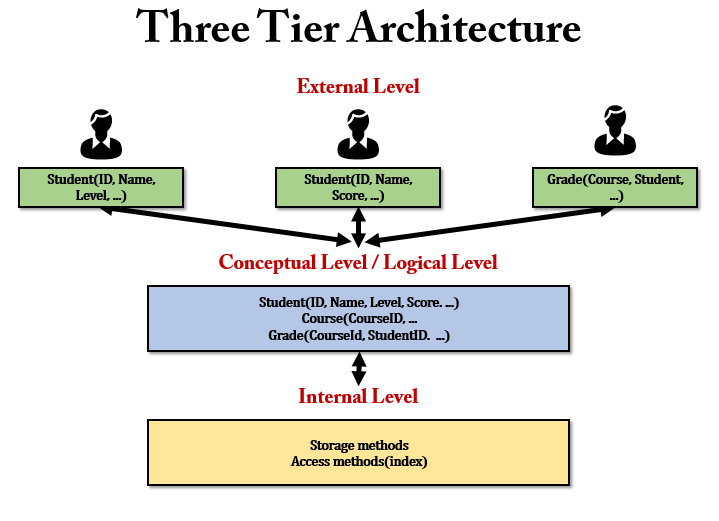
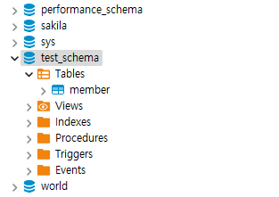

# 스키마


스키마라는 단어는 형태 ,  모양 , 모양 또는 계획 을 의미 하는 그리스어 skhēma 에서 유래했다. 스키마는 심리학에서 정보 범주와 정보 간의 관계를 구성하는 조직화된 사고 또는 행동 패턴을 설명하는 데 사용된다.

## 정의

- 데이터베이스의 구조와 제약조건에 대한 명세를 기술한 것을 의미한다.
- 데이터베이스에서 데이터 저장을 나타내는 추상적인 디자인을 의미한다.

## 특징

- __데이터 사전(= 시스템 카탈로그)에 저장__
    - 데이터베이스에 저장되어 있는 모든 데이터 개체들에 대한 정보를 유지, 관리하는 시스템
    - 대부분 읽기전용으로 제공되는 테이블 및 뷰들의 집합으로 데이터베이스 전반에 대한 정보를 제공.
    - MySQL 에서는 `information_schema` 가 데이터 사전을 의미
        - MySQL 서버 내에 존재하는 DB 의 메타 정보(테이블, 칼럼, 인덱스 등의 스키마 정보)를 모아둔 곳이다.
        - ```sql
          -- information_schema 가 지원하는 모든 정보 확인
          select TABLE_SCHEMA, TABLE_NAME from information_schema.TABLES where TABLE_SCHEMA = 'information_schema';

          -- information_schema 사용
          use information_schema;
          -- 테이블 목록 보기
          show tables;
          ```
       - information_schema 안에 존재하는 것들이 바로 읽기 전용으로 제공되는 애들이다.
- __데이터베이스의 구조에 대한 정의__
- __메타 데이터라고도 함__

> [오라클과 데이터 사전](http://www.gurubee.net/lecture/1520)

## 스키마 3계층



스키마 3계층은 외부, 논리(개념), 내부 총 3단계로 구성된다. 

- __External Level__
    - 사용자 관점에따라 필요한 엔티티와 컬럼이 다른 것을 볼 수 있다.
- __Conceptual Level__
    - Conceptual Level 은 우리가 흔히 생각하는 엔티티라고 생각하면된다.
        - 단, 개념 스키마가 테이블이라는 의미는 아니다. 필드와 데이터 타입을 나타낸 엔티티라고 생각하면 된다.
    - 각 데이터 파일의 필드들이 저장된다.
    - Conceptual Level 에 있는 엔티티를 통해서 External Level 에서는 사용자 관점에 따라 외부 스키마가 구성된다.
- __Internal Level__
    - Conceptual Level 에 있는 엔티티에 저장 크기, 저장 위치, 인덱스, 스토리지 메서드 등 실제 데이터에 접근하기 위한 방법들과 구조들을 담고있다.

> 쉽게 생각하면, ERD 의 산출물이 개념스키마라고 생각하면되고, 하나의 엔티티에서도 사용자 관점에 따라 필요한 속성들이 다르기 때문에, 내부 스키마를 사용자 관점에 따라 추출한 스키마를 외부 스키마라고 생각하면된다. 내부 스키마는 개념 스키마에 저장 크기, 저장 위치등이 추가되었다고 생각하면된다.
> 
> [그림 참고1](https://ozofweird.tistory.com/entry/MySQL-%EB%8D%B0%EC%9D%B4%ED%84%B0%EB%B2%A0%EC%9D%B4%EC%8A%A4-%EC%8A%A4%ED%82%A4%EB%A7%88), [그림 참고2](https://www.javatpoint.com/dbms-three-schema-architecture)

### 외부 스키마

- 서브스키마(사용자 뷰)라고 부르기도 함
- 사용자의 관점에 따라 스키마가 구성된다.
    - Ex. 같은 회사의 CEO 와 직원은 같은 회사에 대해 서로 다른 요구와 인식을 갖는다.

### 개념 스키마

- DB 전체의 `논리적인 구조`를 정의
- 논리적 스키마라고도 함
- 데이터베이스의 엔티티와 해당 속성 및 관계를 정의
- ER 모델링(엔티티 관계 모델링)은 엔티티 유형간의 관계가 무엇인지 지정한다. ER 모델링은 논리적 스키마를 생성하기 위한 도구이다.
 
### 내부 스키마

- 물리적 스키마라고도 함
- 실제로 데이터베이스에 저장될 레코드의 `물리적인 구조`를 정의
- 데이터가 디스크 스토리지에 저장되는 방식을 나타낸다.

## 스키마를 3계층으로 나누어 사용하는 이유

- __장점__
    - 모든 사용자는 물리적 데이터베이스의 스토리지 세부 사항을 직접 다룰 필요가 없다.
    - 각 계층이 분리되어 있으므로, 클라이언트가 데이터베이스 비지니스 로직에 직접 접근할 수 없다.
- __단점__
    - 설정 및 유지 관리가 어렵고, 구조가 복잡하다.

## 테이블 vs 스키마

테이블과 스키마에 대한 내용을 찾아보던 중, 블로그마다 말이 다른 부분도 많아 스택 오버 플로우 답변을 참고하였다.

> https://stackoverflow.com/questions/11618277/difference-between-schema-database-in-mysql/19257781#19257781

- __답변 1__
    - MySQL 에서 물리적으로 스키마는 데이터베이스와 동의어이다. 
    - MySQL 의 SQL 구문에서 DATABASE 대신 SCHEMA 로 대체할 수 있다.
        - Ex. CREATE DATABASE 대신 CREATE SCHEMA
    - 일부 다른 데이터베이스 제품은 구별된다. 예를 들어, Oracle Database 제품에서 스키마는 데이터베이스의 일부, 즉 단일 사용자가 소유한 테이블 및 기타 객체만을 나타낸다.
- __답변 2__
    - DB 벤더마다 다르지만, 보통 스키마는 테이블의 모음을 의미하고 데이터베이스는 스키마의 모음을 의미한다.

MySQL 에서 CREATE DATABASE 대신 CREATE SCHEMA 로 대체가 가능하다고 해서 테스트를 해봤다.




직접 테스트한 결과 동일한 것으로 보인다.

__확실한 건 DB 벤더마다 스키마에 대한 역할, 정의가 조금씩 다르다는 것이다.__

문서를 살펴보자.

[MySQL Document](https://dev.mysql.com/doc/refman/5.7/en/glossary.html#glos_schema). In MySQL, physically, a schema is synonymous with a database. You can substitute the keyword SCHEMA instead of DATABASE in MySQL SQL syntax, for example using CREATE SCHEMA instead of CREATE DATABASE.

문서를 살펴보면, MySQL 에서 CREATE SCHEMA = CREATE DATABASE 가 가능한 이유는 얘네들이(MySQL) Database 명칭을 Schema 라고 부르기로 정했기 때문이다.

면접에서 테이블과 스키마의 차이점에 대해서 물어본다면 다음과 같이 대답할 수 있을 것 같다.

#### 간단하게 답변하는 경우 

진짜 간단하게 답변하는 경우는 `일반적으로 정처기에서 나오는 스키마의 사전적인 의미에 대해서만 답변하는 경우`를 의미한다.

- 테이블 : 행과 열로 구성된 데이터의 집합.
- 스키마 : 데이터베이스의 구조와 제약조건에 대한 명세를 기술한 것을 의미.

#### 조금 더 인상 깊은 답변을 하는 경우

일단 질문의 문맥을 잘 파악해야할 것이다. 스키마 3계층에서 나오는 외부, 개념, 내부 스키마에 대한 개념을 묻는건지 아니면 각 DB 벤더에 존재하는 스키마에 대해 묻는것인지 잘 파악해야할 것이다. 보통은 전자일 것 같다.

만약에, 특정 DB 벤더의 스키마에 대해 묻는거면 아마, `MySQL 에서 스키마란 무엇인가요?` 이런식으로 묻지 않을까 생각한다.

테이블은 행과 열로 구성된 데이터 집합을 의미하고, 스키마는 제약조건, 무결성 규칙, 테이블, 열과 데이터 유형 등을 정의한 것입니다. 저희가 흔히 스키마라고 부르는것은 개념 스키마를 의미하는데, MySQL 에서는 스키마랑 데이터베이스랑 동일하게 볼 수 있습니다. 실제로 MySQL 에서 CREATE DATABASE 대신에 CREATE SCHEMA 를 사용하여 데이터베이스를 생성할 수 있습니다.
오라클에서의 SCHEMA 는 단일 사용자가 소유한 테이블을 의미합니다. DB 벤더마다 스키마가 다른 의미로 사용되고 있다는 것을 볼 수 있습니다.

## References

- https://ko.wikipedia.org/wiki/%EB%8D%B0%EC%9D%B4%ED%84%B0%EB%B2%A0%EC%9D%B4%EC%8A%A4_%EC%8A%A4%ED%82%A4%EB%A7%88
- https://y-oni.tistory.com/75
- https://stackoverflow.com/questions/11618277/difference-between-schema-database-in-mysql/19257781#19257781
- https://rh-cp.tistory.com/42
- https://sidorl.tistory.com/10
- https://www.educative.io/blog/what-are-database-schemas-examples
- https://database.guide/what-is-a-database-schema/
- https://www.guru99.com/dbms-schemas.html
- https://dataedo.com/kb/data-glossary/what-is-database-schema
- http://terms.tta.or.kr/dictionary/dictionaryView.do?word_seq=040542-2
- http://www.mathcs.emory.edu/~cheung/Courses/377/Syllabus/1-files/3-schemas.html
