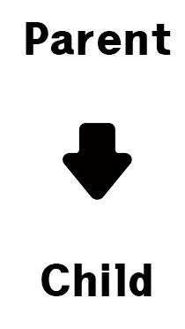

## Promotion, Casting

### type 형 변환

연산을 수행하는 코드에서는 같은 타입끼리만 가능하다. 그래서 연산을 수행하기 전에 같은 타입으로 만들어야 하는데 타입 변환을 하는 것을 형변환 이라고 한다.


### Promotion

자동 형변환, 묵시적 형변환 이라고도 부른다.

작은 데이터 타입에서 큰 데이터 타입으로 형 변환

자바는 타입이 서로 일치하지 않는 경우에도 타입끼리 서로 호환성이 있으면 자동으로 변환을 실시한다.  
자동 변환이 가능한 방향


예를 들어 short 타입은 16비트 정수이고, int 타입은 32bit 정수이므로 short 타입의 값으로 취급해도 값이 변하는 문제는 발생하지 않는다.

그렇다면 long 데이터 타입의 메모리 크기는 8byte이고, float 데이터 타입의 메모리 크기는 4byte인데, long 데이터 타입에서 float 데이터 타입으로 자동 형변환이 가능하다. 그 이유는 표현할 수 있는 값의 범위가 float가 더 크기 때문이다.

```java
short shortNum = 100;

int intNum = shortNum;                // 확장성에 의한 자동 변환 (short -> int)
System.out.println(intNum);
```

```java
int a = 1.0; // 컴파일 에러
```

### Casting

강제 형변환, 명시적 형변환 이라고도 불린다.

데이터의 손실이 발생하더라도, 형변환을 하고 싶을 때 사용하는 것이 Casting이다.

```java
int a = (int)1.0; //컴파일 에러 해결
```

1.0이 int a 변수에 들어가면 1로 바뀌기 때문에 실제 데이터가 손실되는 것을 방지하기 위해 막고자 컴파일 에러가 나게되는데, 코드를 작성하는 프로그래머가 데이터가 손실된 다는 것을 이미 알고 있어도 이용하고 싶을 때 사용하는 것이 Casting이다.

### 참조형 Casting
- 업 캐스팅

```java
int a = (int)true;
```
boolean 자료형이랑 int 자료형이랑은 서로 성질이 맞지 않는 데이터이므로, Casting을 해도 형변환이 되지 않는다.

참조형 데이터 역시 마찬가지다.

참조형 데이터가 Casting이 되려면 다음 조건중 1개는 만족해야한다.
1. 상속관계가 맺어진 경우
2. 인터페이스로 인해 확장이 된 경우

상속 관계로 예를 들어보면

`class Parent` , `class Child extends Parent` 클래스 가 있다고 가정하자.

Child는 Parent 클래스를 상속 받으므로 Child 클래스가 Parent 클래스보다 가지고 있는 데이터 양이 무조건 많다.

```java
Parent parent = new Child();
```

new Child라는 인스턴스는 변수가 원하는 데이터를 모두 가지고 있으므로 형변환 코드를 붙이지 않아도 가능한 코드이다.

위와 같은 캐스팅을 업캐스팅 이라 부른다.


Parent에 Child 데이터를 넣으므로 화살표 방향이 위로 가게 되어 업캐스팅이라 부른다.

- 다운 캐스팅

위와 같이 상속 관계에 있을 경우 캐스팅이 가능하지만 아래와 같은 코드는 성립하지 않는다.

```java
Child child = new Parent();
```

왜냐하면, 변수가 원하는 정보를 인스턴스가 모두 가지고 있지 않기 때문이다.

```java
Child child = (Child) new Parent();
```
위 코드는 컴파일 에러가 나지는 않지만 런타임 오류가 발생한다.

컴파일러는 형변환을 해줌으로써 데이터를 맞게 넣어준것처럼 보여 문법이 맞다고 생각하여 넘어가지만

프로그램이 실제로 동작할 때, new Parent() 인스턴스는 Child형 데이터로 바꾸지 못한다는 것을 깨닫고, 런타임 오류를 내며 종료된다.



Child 데이터에 Parent 데이터를 넣는 경우는 화살표가 아래로 향하므로 다운캐스팅 이라 부른다.

위와 같은 예시를 봤을 때 다운캐스팅은 일반적으로 성립하지 않는다. 하지만 다운캐스팅이 성립되는 경우가 존재한다.

```java
Parent parent = new Child();
Child child = (Child) parent;
```

위에 예시는 다운 캐스팅이 성립된다.

parent 변수는 Parent 클래스 형태의 변수지만, 태생이 Child 인스턴스인 데이터를 넣어주었다.

그러한 정보를 가지고 있는 parent 변수를 다시 Child 클래스 형태로 다운캐스팅을 하였으므로 가능한 코드이다.

결과적으로 다운캐스팅은 보통 성립되지 않는 문법이지만, 업캐스팅이 선행된 경우, 다운캐스팅이 성립되는 경우가 존재한다.

<br>

## call by value vs call by reference

### Call by value

메소드 호출 시에 사용되는 인자의 메모리에 저장되어 있는 값(value)을 복사하여 보낸다.
`int a = 3`이 있으면 메소드에서 인자값을 받을 때 a라는 자체에 주소를 받는게 아니라 a의 값인 3을 받아 처리하는 방식이다.

```java
public class Diffrence {
    
    static void swapS(String one, String two) {
        String temp = one;
        one = two;
        two = temp;
    }
    
    public static void main(String args[]) {
        String a = new String("안녕");
        String b = new String("잘가");

        System.out.println("Before");
        System.out.println(a+b); // 안녕잘가
        swapS(a,b);
        System.out.println("After");
        System.out.println(a+b); // 안녕잘가
    }
}
```

스왑 메소드를 이용해서 서로를 바꿔준 것 같지만 바뀌지 않는 이유는 call by value 방식이기 때문이다.  
스왑 메소드가 받는 두 인자는 인자값에 주소 즉 인자 그자체를 받는 것이 아니라 인자의 값을 복사해서 받는다.

즉 String one에는 a에 값인 "안녕"에 값을 복사 마찬가지로 two에도 b의 주소가 아닌 b값에 주소가 복사되어진다.

직접적인 참조를 넘긴 게 아닌, 주소 값을 복사해서 넘기기 때문에 자바에서는 기본형, 참조형 모두 call by value 방식을 사용한다.


이렇게 메인 메소드의 a,b와 swapS 메소드의 one, two는 서로 같은 값을 참조할 뿐이다.


그러므로 main값에 영향을 주지 못하고 자바는 항상 call by value 방식을 사용한다.

만약 call by reference 방식 이였으면 메소드내에서 one,two가 a,b의 주소값을 받아 서로 값이 바뀌니 메소드 수행을 하고나서도 a,b가 바뀌어 있을 것이다.

이러한 효과를 내는 방법은 있다.

```java
public class Diffrence {
    int value;
    
    Diffrence(int value) {
        this.value = value;
    }
    
    public static void swap(Diffrence one, Diffrence two) {
        int temp = one.value;
        one.value = two.value;
        two.value = temp;
    }
    
    public static void main(String[] args) {
        Diffrence a = new Diffrence(10);
        Diffrence b = new Diffrence(20);

        System.out.println("swap() 호출 전 : a = " + a.value + ", b = " + b.value);
        swap(a,b);
        System.out.println("swap() 호출 후 : a = " + a.value + ", b = " + b.value);
    }
}
```
결과값은  
swap() 호출 전 : a = 10, b = 20
swap() 호출 후 : a = 20, b = 10

이렇게 값이 바뀌는 걸 볼 수 있다.


마찬가지로 one과 two는 값의 주소를(call by value) 복사 받아 같은 인스턴스를 참조하는 것 이지만


이렇게 참조 되어지는 값을 바꾸어 주어 마치 call by reference가 이루어진 것 처럼 보인다.

<br>

## Autoboxing vs Unboxing

### Autoboxing

자바 컴파일러가 primitive data type을 그에 상응하는 wrapper class로 자동 변환 시켜주는 것을 의미한다. 예를 들어 int를 Integer로, double을 Double로 변환 시키는 것을 의미한다.

```java
public static void main(String[] args) {
    int i = 7;
    autoBoxing(i);
}

public static void autoBoxing(Integer I) {
    System.out.println(I);
}
```
위 코드는 int를 Integer로 변환시키는 예제이다.

### Unboxing

자바 컴파일러가 wrapper class를 primitive data type 으로 자동 변환 시켜주는 것을 말한다.

```java
public static void main(String[] args) {
    Integer i = new Integer(7);
    unBoxing(i);
}

public static void unBoxing(int i) {
    System.out.println(i);
}
```

위 코드는 Integer를 int로 변환 시키는 예제이다.

<br>

---

### Reference

https://league-cat.tistory.com/412

https://mommoo.tistory.com/41?category=577684

https://mommoo.tistory.com/51

https://jamesdreaming.tistory.com/154

https://sleepyeyes.tistory.com/11