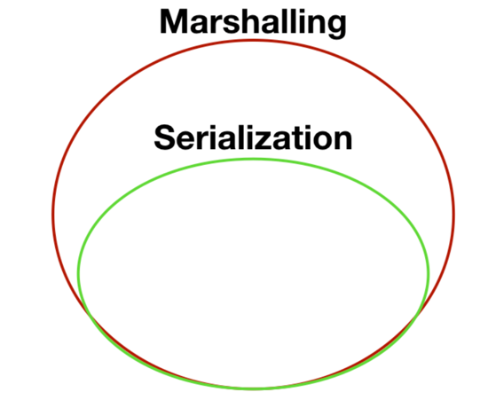

## 마샬링과 직렬화



직렬화와 마샬링은 거의 비슷하게 사용된다. 위에 사진과 같이 마샬링이 직렬화보다 더 큰 범위를 가지며, 직렬화는 마샬링의 한 부분이다.

### 직렬화 (Serialization)

직렬화는 객체의 필드를 바이너리 형식이나 바이트스트림으로 바꾸는 작업을 말한다. 굳이 바이트 스트림이 아니여도 파일이나, 메모리, 데이터베이스 등으로 바꾸는 
작업도 포함된다.

JVM의 메모리에 상주(힙 또는 스택)되어 있는 객체 데이터를 바이트 형태로 변환하는 직렬화 기술과 직렬화된 바이트 형태의 데이터를 객체로 변환해서
JVM으로 상주시키는 역직렬화가 있다.


> 바이트스트림 (Byte Stream)  
> 스트림은 데이터 배열이다. Input Stream은 데이터를 읽으며 Output Stream은 데이터를 쓰는 작업이다.
> 자바 바이트 스트림은 바이너리 파일같은 로우 데이터를 처리하는데 알맞다.

자바에서는 객체의 직렬화, 역직렬화를 위해 ObjectInputStream과 ObjectOutputStream을 제공한다.

```java
// 객체를 직렬화하여 파일에 저장
ObjectOutputStream oos = new ObjectOutputStream(new FileOutputStream("objectfile.ser"));
oos.writeObject(new Member());

// 파일로부터 객체를 읽어 객체 생성
ObjectInputStream ois = new ObjectInputStream(new FileInputStream("objectfile.ser"));
Member member = (Member) ois.readObject();  // Object로 리턴되므로 명시적 형변환 필요
```

__직렬화 적용 분야__

- 파일 저장소
  - 프로그램 실행 중에 생성된 데이터를 파일시스템에 저장한 후, 이후에 프로그램이 다시 실행되었을 때 저장된 데이터를 다시 사용한다.
- 네트워크 통신
  - 네트워크 상에 떨어져 있는 프로그램 간에 데이터를 주고 받기 위해 데이터를 직렬화한 후, 패킷(packet)에 담아 전송한다.
- 데이터베이스
  - 복잡한 형태의 객체를 데이터베이스에 저장할 때 직렬화한 문자열 형태로 테이블의 컬럼에 저장하기도 한다.
- 웹 환경
  - 웹 서버에서 브라우저(클라이언트)로 구조화된 데이터를 전송할 때 직렬화 한 후 (JSON 형식 등) 전달하는 방식

__직렬화가 불가능한 클래스들__

- 이벤트 어댑터
- 이미지 필터
- AWT 클래스
- beans
- Socket
- URLConnection

__Serializable__

java.io.Serializable 인터페이스를 구현한 클래스만 객체를 직렬화 할 수 있다.

- 상속(is-a)
  - 부모 클래스가 Serializable을 구현하면 
    - 자식 클래스는 항상 직렬화가 가능하다.
    - 자식 클래스를 직렬화 하면 부모 클래스의 인스턴스 변수도 함께 직렬화 된다.
  - 자식 클래스만 Serializable을 구현하면
    - 부모 클래스의 인스턴스 변수는 직렬화되지 않는다.
    - 부모 클래스의 인스턴스 변수도 직렬화 대상에 포함하려면 두 가지 방법이 있다.
      - 조상 클래스가 Seializable을 구현한다.
      - 직렬화 코드를 직접 구현한다.
- 포함 (has-a)
  - 클래스가 직렬화 할 수 없는 객체를 인스턴스 변수로 참조하고 있으면
    - 직렬화 불가
    - 직렬화 불가한 인스턴스 변수에는 transient를 붙여 제외하고 직렬화 가능

직렬화 코드 예시
```java
public class Student implements Serializable {
    public static final long serialVersionUID = 1234L;

    private  long studentId;
    private String name;
    private transient int age;

    public Student(long studentId, String name, int age) {
        this.studentId = studentId;
        this.name = name;
        this.age = age;
    }

    @Override
    public String toString() {
        return "Student{" +
                "studentId=" + studentId +
                ", name='" + name + '\'' +
                ", age=" + age +
                '}';
    }
}
```

__serialVersionUID__

직렬화 수행 시 클래스 정보를 가지고 생성되는 클래스의 버전 값, 역직렬화 수행 시 이 값을 가지고 비교해서 일치해야 한다. serialVersionUID를 선언하지 않으면
JVM에서 자동으로 생성해준다. 그러나 명시하는 것을 권장사항으로 하고 있다. 그 이유는 Class가 update 될 경우 serialVersionUID가 변경 될 수 있기 때문이다.

__transient__

JPA에서 데이터베이스에 연관 짓고 싶지 않은 변수위에 @Transient 어노테이션을 선언하는데 여기서도 같은 역할을 한다. transient 표시되어 있는 변수는
직렬화에서 제외되어 write와 read하지 않는다.

__JSON 직렬화, 역직렬화__

지금까지는 객체 직렬화를 JVM과 ObjectInputStream/ObjectOutputStream에 위임하는 방식이었지만 XML, JSON과 같은 포맷을 이용한 직렬화도 가능하다. 이로 인한 장점은 다른 환경, 다른 언어로 만들어진 어플리케이션과도 통신이 가능해진다는 것이다.

JSON 파싱, 처리 라이브러리를 사용하여 자바 객체를 JSON으로 직렬화하거나 JSON 데이터를 자바 객체로 역직렬화할 수 있다. (JackSon 등 사용)

__JPA Entity에 Serializable을 꼭 상속해야 할까?__

직렬화는 JVM 메모리에 상주되어 있는 객체 데이터를 그대로 영속화 할 때 사용된다. 시스템이 종료 되더라도 없어지지 않고 영속화 되어 네트워크로 전송도 가능하다.

따라서, 이 객체를 어딘가로 전송하거나 세션에 기록하거나 등등 정말 serialization을 위한 용도가 아니라면, Hibernate 상에서는 굳이 Serializable을
구현하지 않아도 되지만, 그래도 Serializable을 구현하는 것이 좋은 습관이라고 한다.

참고 : https://bvaisakh.wordpress.com/2015/03/04/do-jpa-entities-have-to-be-serializable/

### 마샬링 (Marshalling)

마샬링은 직렬화와 거의 비슷한데 다른점은 코드베이스를 포함하여 객체를 직렬화 한다.


__코드베이스?__

코드베이스는 객체를 받는이에게 이 객체의 구현을 어디서 찾을 수 있는지에 관한 정보를 말한다. 만약 다른 프로그램에게 객체를 전달했는데 이 객체를 다시 사용
하려면 데이터 타입에 관한 정보가 있어야 한다. 코드베이스는 이 데이터가 어디에 있는지 알려주는 정보를 말한다.

코드베이스가 있기 때문에, 객체의 정보를 알지 못하는 다른 JVM에게 마샬링을 통해서 건네주면, 그 JVM이 언마샬링을 통해, 객체를 원래 상태로 되돌릴 수 있다.
이런 장점을 통해 RMI 같은 기능을 사용할 수 도 있다.

> RMI (Remote Method Invocation)  
> RMI을 사용하면 자바에 분산 애플리케이션 메카니즘 API를 제공할 수 있다.
> RMI는 객체가 다른 JVM에서 실행중인 객체에서 메서드를 호출할 수 있다.


---

### Reference

https://donghyeon.dev/2020/11/07/%EC%A7%81%EB%A0%AC%ED%99%94%EC%99%80-%EB%A7%88%EC%83%AC%EB%A7%81/

https://jongminlee0.github.io/2020/03/15/serializable/

https://bravenamme.github.io/2020/02/05/java-serializable/

https://atoz-develop.tistory.com/entry/JAVA%EC%9D%98-%EA%B0%9D%EC%B2%B4-%EC%A7%81%EB%A0%AC%ED%99%94Serialization%EC%99%80-JSON-%EC%A7%81%EB%A0%AC%ED%99%94
