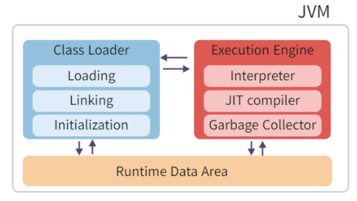
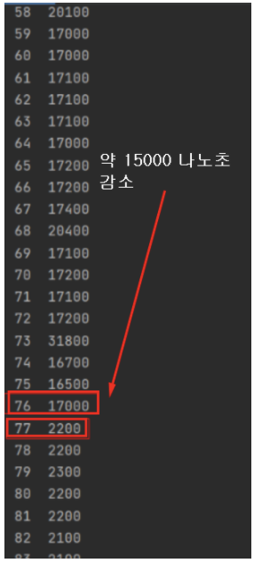

# 전체 순서
1. 소스파일을 작성한다. (*.java)
2. 자바 컴파일러를 통해 컴파일 하여, 바이트파일(*.class)을 생성한다.
    1. 바이트파일이 뭔가요 ?
        1. 기계가 읽기 편하도록 만든 파일입니다.
        2. 이 파일을 JVM 이 읽어서 기계어로 바꾸고 나서, 실행합니다.
        3. (*.class) 파일은 최종적으로 실행되는 파일은 아니다.
3. 프로그램 실행에 필요한 클래스 (*.class) 를 로드한다.
    2. ClassLoader 를 **동적 로딩**을 통해 (*.class) 파일들을 JVM 에 올린다.
    3. JVM 에 있는 .class 파일들을 Execution Engine 이 명령어 단위로 하나씩 실행하는데, 이 때 내부적으로는 Interpreter와 JIT Complier 를 통해 해석한다.
    4. 해석된 바이트 코드는 Runtime Data Areas 에 배치되어 실질적인 수행이 이루어진다.
       
4. 지정된 클래스에서 main(String[] args) 를 호출한다.
5. main 메서드의 첫 줄부터 코드가 실행되고, 마지막 코드까지 실행되면 프로그램이 종료되고, 사용된 자원들은 반환이 된다.
## 인터프리터

런타임 시에 한줄한줄 분석함.

소스코드의 각 행을 연속적으로 분석하며 바이트코드를 기계가 읽을 수 있는 언어인 기계어로 변환합니다.

속도 측면에서는 전체 소스코드를 보고 명령어를 해석하는 자바 컴파일러보다 느립니다.

이를 개선하여 도입한 것이 바로 JIT 컴파일러(Just-In-Time Compiler) 입니다.

인터프리터와 컴파일러의 방식을 **적절히 혼합**해서 속도를 개선한다.

## JIT 컴파일러

JRE 안에 존재하면서 프로그램을 실행할 때 기계어로 번역하는 것을 말한다.

JIT는 **Just In Time (제 때)** 라는 뜻이며 이는 **자바 메서드를 호출할때**를 말한다.

이 자바 메서드는 처음 호출 되자마자 바로 컴파일 되는게 아니다.

JVM이 호출되는 메서드 각각에 대해 호출마다 호출 횟수를 누적해서 그 횟수가 특정 수치를 초과 할 때 컴파일하는 것이다.

즉, 얼마나 자주 호출되는지 검사한 후 '이제는 컴파일이 필요한 시점이다'라고 판단하는 어떠한 기준이 있는 것이다.

이 기준을 **컴파일 임계치** 라고 한다.

## 컴파일 임계치

다음의 2가지를 합친 것을 말한다.

- **method entry counter (JVM 내에 있는 메서드가 호출된 횟수)**
- **back-edge loop counter (메서드가 루프를 빠져나오기까지 돈 횟수)**

두 카운터의 합계를 확인하고 메서드가 컴파일될 자격이 있는지 결정한다. **메서드가 컴파일 될 자격이 있다면 해당 메서드는** **컴파일되기 위해 큐에서 대기**하게 된다.

그러면 이 메서드들은 **이후 컴파일 스레드에 의해 컴파일** 되는 것이다.

대표적인 예시로 메서드가 실행되는 루프가 정말 길 경우 중간에 컴파일하는 경우이다.

루프의 실행을 그때그때 카운트하고 컴파일 임계치를 넘게되면

전체 메서드가 아닌 루프만을 컴파일하여 컴파일된 버전을 바로 실행시키는 것이다.


```java
for (int i = 0; i < 500; ++i) {
  long startTime = System.nanoTime();   /* 나노 초 단위로 시간 측정 */

  for (int j = 0; j < 1000; ++j) {
 	new Object();
  }

  long endTime = System.nanoTime();   /* 나노 초 단위로 시간 측정 */
  System.out.printf("%d\t%d\n", i, endTime - startTime);
}
```




76 번째 부터 컴파일 임계치라고 생각하면 될 것 같다. 이 후로는 이미 캐싱이 되어있기 때문에 시간이 훨씬 더 빨라졌다.

## Code Cache

JIT 컴파일러가 데이터를 저장하는 영역, 메모리에 있다.

자주 접근하는 ‘컴파일 된 코드 블록’ 이 저장된다.

즉, 기계어로 이미 변환된 채 캐시되어 저장되어 있다.