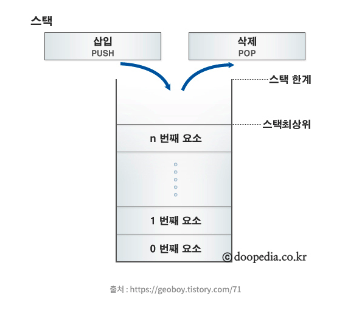
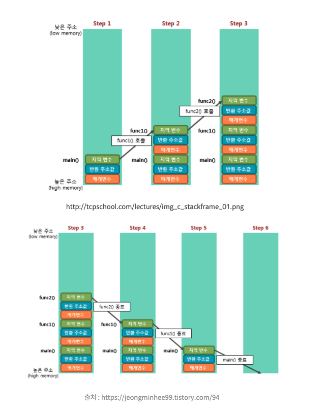
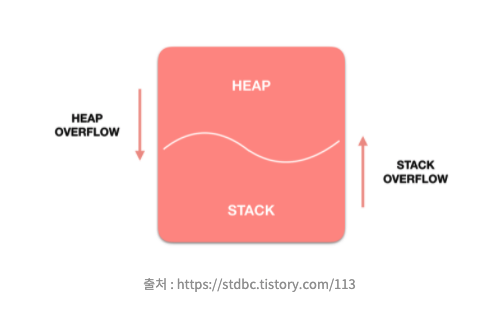

## Memory Model


> High Address

메모리 구조에서 높은 주소 영역으로, Heap, Stack 이 포함된다.

> Low Address

메모리 구조에서 낮은 주소 영역으로, Data 영역, Code 영역이 포함된다.

> BSS/GVAR

Data 영역이 BSS와 GVAR(Data) 영역으로 나눠진다. BSS 영역에는 초기화되지 않은 데이터가 저장되고, GVAR 영역에는 초기화된 데이터가 저장된다.

> \* 영역이 BSS로 분리되는 이유는?  
> 초기화된 데이터는 초기화되지 않은 변수와 다르게, 해당 값을 프로그램에 저장하고 있어야 한다. BSS 영역은 초기화되지 않은 데이터가 저장되기 때문에, 프로그램이 실행될때 영역만 차지하고 그 값을 프로그램에 저장하고 있을 필요가 없다. BSS 영역 변수들이 많아져도 프로그램의 실행 코드 사이즈를 늘리지 않는다.

> TEXT

Code 영역으로 보면 된다.

우선, 그림에 보여지는 생소한 용어들을 정리해보았다. 이를 바탕으로 메모리 구조에 대해 상세히 알아보자.

## 메모리 구조 

OS의 메모리 구조는 유저 영역, 커널 영역 2가지로 분리된다. 편리한 관리를 위해 일반 프로그램을 실행시키기 위해서 필요한 메모리 공간과 운영체제의 실행을 위한 메모리 공간을 분리시켰다.

| 유저 영역 | 커널 영역 |
| --- | --- |
| 스택 영역, 힙 영역, 데이터 영역, 코드 영역으로 나뉜다.   이를 하나의 프로세스를 묶어놓은 세그먼트(segement)라고 한다.   각 프로세스마다 세그먼트가 존재한다.       프로그램이 동작하기 위해 사용되는 메모리 공간이다.      \* 위 Memory Model이 유저 영역이다. | 운영체제의 핵심인 커널이 위치하고 있다.      커널은 시스템의 모든 것을 완전히 통제하기 때문에 유저 모드에서 직접 접근할 수 없고, 접근시 system call을 통한 커널 모드로의 전환이 필요하다.      \* 커널이란?   운영체제라는 하나의 소프트웨어를 실행시키기 위해서 필요한 메모리 공간       하나의 프로세스에 할당되는 총 메모리 공간 중에서 유저 영역을 제외한 나머지 영역을 말한다.  |

## 유저 영역

> 1) 데이터 영역

- 프로그램이 구동되는 동안 항상 접근이 가능한 변수가 저장된다.

- 초기화되지 않은 데이터가 저장되는 BSS, 초기화된 데이터가 저장되는 GVAR 2가지 영역으로 나눠진다.

- 프로그램의 전역 변수와 정적(static) 변수가 저장된다.

- 프로그램 시작과 함께 할당되고, 프로그램이 종료되면 소멸된다.

> 2) 코드 영역

- 실행할 프로그램의 코드가 저장되는 영역이다.

- CPU는 코드 영역에 저장된 명령을 하나씩 가져가서 처리한다.

- 프로그램이 시작되고 종료될 때까지 메모리에 계속 남아있는다.

> 3) 힙 영역

- 동적으로 메모리를 할당하여 사용하는 공간이다.

- 참조형의 데이터 값이 저장된다.

> 4) 스택 영역



- 지역변수와 매개변수가 저장되는 영역이다.

- 사용자에 의해 메모리 공간이 동적으로 할당되고 해제된다.

- 메모리의 낮은 주소 -> 높은 주소의 방향으로 할당된다.

> ** 스택 동작 단계
> 1) 함수 호출 발생
> 2) 현재 실행중인 함수의 정보를 저장할 스택 프레임이 생성되고 콜 스택에 푸쉬된다.
> 3) CPU가 함수의 시작점으로 이동
> 4) 함수 내부의 명령어 실행
> 5) 함수 종료 후 레지스터 복원
> 6) 스택 프레임이 콜 스택에서 나오고 종료된 함수의 모든 변수 메모리 해제
> 7) 반환값 처리
> 8) 반환 주소에서 실행 재개

> sp 레지스터  
> 스택에 데이터를 쌓거나 반환하기 위해 쌓아올린 스택 위치를 기억을 하기위한 CPU 내에 SP (Stack Pointer)라는 이름의 레지스터이다.  변수가 선언되면 현재 SP가 가리키는 위치에 할당하기 때문에 SP 위치를 아래로 이동시키는 것만으로도 이전에 선언된 변수를 반환할 수 있다. 변수 할당시 이전에 저장된 값들을 덮어쓸 것이다. 호출이 완료된 함수를 빠져나오는 시점에서 SP를 얼마만큼 이동시켜야할 지 모른다. 이때는 이 역할을 프레임 포인터 레지스터가 한다.


> 스택 프레임 단계
```
int main(void) {
    func1();  // func1() 호출
    return 0;
} 

void func1() {
    func2();  // func2() 호출
}

void func2() { 
}
```


## 스택영역과 힙 영역의 장단점

|   | 스택 영역 | 힙 영역 |
| --- | --- | --- |
| 장점 | - 데이터 액세스가 빠르다.   <br/>- 변수를 사용자가 관리하지 않아도 된다.   <br/>- 하나의 명령으로 메모리 조작과 어드레스 조작이 가능하다. | - 변수를 전역적으로 액세스할 수 있다.   <br/>- 메모리 크기에 제한이 없다.   <br/>- 객체의 개수나 크기를 알 수 없어도 사용 가능하다. |
| 단점 | - 메모리 단편화가 불가능하다.   <br/>- 지역변수만 저장된다.   <br/>- 스택 크기가 제한되어있다.   <br/>- 변수의 크기를 조정할 수 없다.    | <br/>- 상대적으로 데이터 액세스가 느리다.   <br/>- 메모리를 직접 관리해야한다. |



스택 영역과 힙 영역은 같은 공간을 공유하기 때문에, 각 영역에 따라서 사이즈가 조절된다. 스택 영역이 클수록 힙 영역이 작아지고, 힙 영역이 클수록 스택 영역이 작아진다. 각 영역이 상대 공간을 침범하는 것을 각각 힙 오버플로우, 스택 오버플로우라고 한다.


#### Reference.

[https://junghyun100.github.io/%ED%9E%99-%EC%8A%A4%ED%83%9D%EC%B0%A8%EC%9D%B4%EC%A0%90/](https://junghyun100.github.io/%ED%9E%99-%EC%8A%A4%ED%83%9D%EC%B0%A8%EC%9D%B4%EC%A0%90/)

[https://mentum.tistory.com/475](https://mentum.tistory.com/475)

[https://popcorntree.tistory.com/61](https://popcorntree.tistory.com/61)