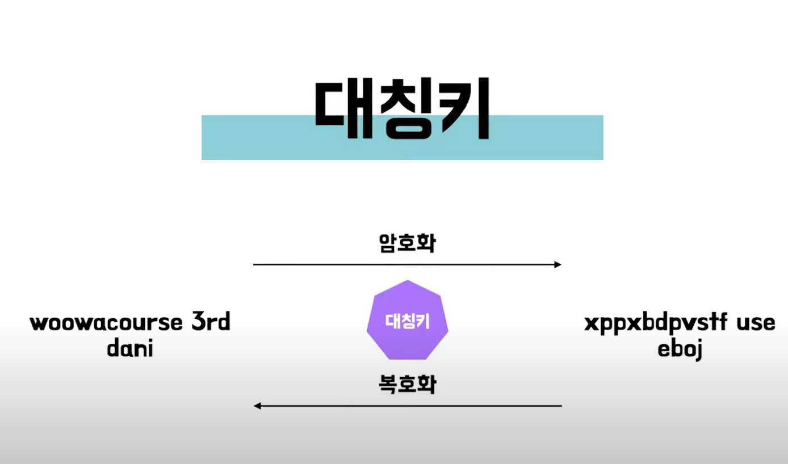
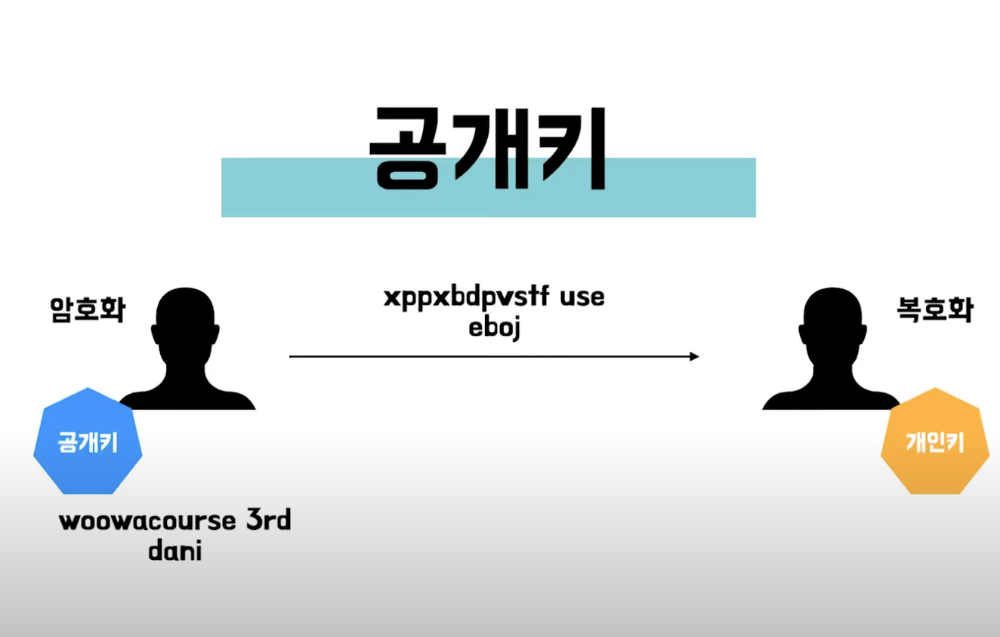

# HTTP(Hypertext Transfer Protocol)
> Hypertext: 다른 페이지의 링크를 담고 있는 문서   
  Transfer: 이동 통신  
  Protocol: 규약  

한마디로 정의하면 서로 다른 시스템들 사이에서 통신을 주고 받게 해주는 application 계층의 protocol이다.
  
Web Browser와 Web server간의 communication을 위해 디자인되었다. 

## HTTP의 특성
 ### 1. 비연결성(Connectionless) 
 Client와 Server가 한번 연결을 맺은 후에 Client의 요청에 대해 Server가 응답을 마치면 연결을 끊어버린다.

 > - __왜 HTTP프로토콜은 한번 맺은 연결을 끊을까?__
    server에서 다수의 client 와 연결 지속시 많은 리소스 발생하게 된다. 그래서 server가 응답을 마친 후 연결을 끊어 연결유지를 위한 리소스를 줄이고 더 많은 연결을 할 수 있게 된다.

 > - __하지만 server가 client를 기억 하지 못해 모드 요청에 대해 매번 새로운 연결을 해야되는 일이 발생한다.__
     이렇게 되면 연결 해제에 대한 오버헤드가 발생하게 된다.

 > - __Keep Alive__  
     위에 발생한 오버헤드를 줄이기 위해 server와 client사이 상대방의 안부를 묻기 위해 packet을 주기적으로 보낸다.  
    _만약 패킷에 대해 반응이 없으면 접속도 끊는다_
      하지만 이 방법은 주기적으로 패킷을 보내며 확인해야해서 서버가 바쁜 상황에서서 process수가 늘어나고 keep alive를 유지하기 위한 메모리가 많아져 주의해야한다.
  
 
 ### 2. 무상태 프로토콜(Stateless protocol)
   Connectionless로 인해 server가 두 요청간의 어떠한 데이터도 유지하지 않아 server는 client를 식별하지 못한다.
 >   1. 배달의 민족에 접속한다
 >   2. 로그인을 한다.
 >   3. 시킬 가게를 정하고 음식을고른다
 >   4. 배달을 시키기 위해 다시 로그인한다
 >   5. 주문을 한다.
 >   6. 다시로그인을 한후
 >   7. 확인을 한다. 

 이렇게 매번 새로 인증을 해줘야 한다.  
 그래서 cookie(브라우저에 상태 저장)와 session(server에 상태 저장)을 사용해 기억한다.
 하지만 이 방법들을 데이터를 안전하게 저장하지 않아서 data를 안전하게 보호해야하는 경우에는 토큰을 사용해 보호할 data를 토큰으로 전환해 사용하기도 한다. 각 상황에 맞게 사용한다.

 ### 3. Transfer layer
   일반적으로는 신뢰성이 더 높은 TCP/IP연결을 사용한다. 

## HTTP의 흐름
> 1. TCP연결을 열어준다.(TCP연결은 요청을 보내거나 받는데 사용). 새연결 혹은 기존 연결을 재사용할 수 있다.  
> 2. HTTP메시지 전송한다.
> 3. 서버가 보낸 응답을 읽는다.
> 4. 연결을 닫거나 다른 요청을 위해 재사용한다.

 ## HTTP메시지
HTTP 메시지에는 request(요청)과 respoonse(응답)이 있다. 
request를 통해서 구조를 간단히 보면
 
http 메서드, 경로, http버전 , 헤더로 이루어져 있다.

 ## HTTP 요청 메서드
 client에서 server가 수행하기 원하는 동작을 보낸다. 여러가지 있지만 대표적인 4개만 가져왔다.

 - Get: 주로 데이터를 가져올때 사용하는 메서드다.
 - Post: 데이터를 입력할때 사용한다.
 - Put: 데이터를 수정할때 사용한다.
 - Delete: 데이터를 삭제시에 사용한다.

> - Get v.s Post  
  Get의 경우 querystring(url의 끝에 ?와 함께 이름과 값으로 이뤄진 요청파라미터)을 통해 요청을 보낸다.  
  반면, post의 경우에는 전송데이터를 body에 담아 전송한다. 그래서 눈에 안보이고 get보다 안전하다.(chrome 개발자 도구를 사용하면 확인이 가능하기에 암호화를 해야한다). 또 요청의 header에 content-type을 표시해줘야 한다.(content type은 보내는 type에 따라 달라진다 json형식으로 보낸다면 'application/json')

> content type 은 해댕 개체에 포함되는 미디어 타입의 정보이다.

> - Post v.s Put v.s Patch  
먼저 post의 경우 기존에 없던 데이터를 새로 입력할때 사용한다. 예를 들어 새로들어온 신규 가입자가 회원가입을 할때 사용되겠다. Put의 경우에는 이미 있는데이터를 바꿀때 사용한다. 하지만 put은 바꾸지 않는데이터 까지 함께 보내줘야 한다. 이제 부분적으로만 데이터를 바꿀때는 patch를 사용한다. Patch는 put과 다르게 데이터를 바꿀 부분만 넘겨주면 된다. 

  ## HTTP 헤더
  Client와 Server가 부과적인 정보를 http메시지와 함께 보낼 수 있게 해준다.  

  - General header: 요청과 응답 메시지 모두 사용 가능한 일반 목적의 헤더
  - Request header: http 요청 메시지 내에서만 나타나며 방대
  - Response header: 특정 http요청이나 http 헤더를 수신했을때 응답 목적의 헤더

  - Entity Header: 요청 및 응답 메시지 모두에서 사용 가능한 Entity(콘텐츠, 본문, 리소스 등)에 대한 설명 헤더 항목

# HTTPS(Hypertext Transfer Protocol Secure)
원래 HTTP는 Server에서 Client로 보내는 정보를 암호화를 하지 않았다. 이 말은 데이터가 쉽게 도난당할 수 있다는 뜻을 의미한다. 그래서 HTTP에서 모든 요청과 응답을 SSL이나 TLS를 사용해 암호화 시킨것을 HTTPS이다. 

> TLS는 가장 최신 기술로 더 강력한 버전의 SSL입니다. 그러나 SSL이 더 일반적으로 사용되는 용어입니다.

## SSL(Secure Sockets Layer, SSL)
보안 소켓 계층  
웹사이트와 브라우저(혹은, 두 서버) 사이에 전송된 데이터를 암호화하여 인터넷 연결을 보안을 유지하는 표준 기술입니다. 이는 해커가 개인 정보 및 금융 정보를 포함한 전송되는 모든 정보를 열람하거나 훔치는 것을 방지합니다.

### SSL 디지털 인증서
클라이언트와 서버간의 통신을 공인된 제3자(CA) 업체가 보증해주는 전자화된 문서

### SSL인증서의 장점
1. 통신내용 노출 변경 방지
2. client가 접속하려는 server가 신뢰가능한 server인지 확인
3. SSL통신에 사용할 공개키를 client에게 제공

### 암호화 방식
> 1. 대칭키  
encoding, decoding과정에 같은 키를 사용한다.
발송자와 수신자 둘다 키 보유한다. 대칭키 전달 과정시에 키 유출될 위험이 있다.
 

 

> 2. 공개키
대칭키 전달 과정에서 유출될 위험이 있어 나온것이 공개키다.
encoding과 decoding과정에서 서로 다른 키를 사용한다. 
 
공개키로 암호화시에 개인키로 복호화를 한다. 공개키는 공개되어 있고 encoding시에 사용된다. 개인키는 decoding시에 사용하고 호스트만이 개인 디코딩키를 가지고 있다.
하지만 공개키는 느리다는 단점을 가지고 있다.

> - 왜 공개키가 더 느릴까?  
비대칭키(공개키)의 대표적인 알고리즘으로는 RSA, 디피-헬만, 타원곡선암호 등이 있습니다. 가장 대표적인 RSA는 기본적인 정수론, 소수를 이용하는데 중요 정보를 두 개의 소수로 표현한 후, 두 소수의 곱을 힌트와 함께 암호로 사용합니다. c = a * b(a, b는 소수)라 할 때, a, b를 가지고 c를 구하는 것은 비교적 쉽게 구할 수 있지만 c를 먼저 제시하고 곱해진 두 소수 a, b를 구하는 문제는 풀기가 쉽지 않습니다. c를 공개해도 a 또는 b를 구하는 것이 대단히 어려우므로 c는 공개키로, a는 개인키로 사용합니다.  
그러나 수학적인 난제를 기반으로 설계된 비대칭키(공개키)는 암호화나 복호화를 수행하기 위한 연산이 복잡한 수학 연산을 기반으로 구성되어 있기 때문에 효율성이 대칭키 암호(AES, SEED)에 비해 약 1,000배에 달합니다.
비대칭키는 길이가 긴 키의 소인수 분해가 어렵다는 특성을 활용한 알고리즘인 만큼 대칭키에 비해 키 사이즈가 상대적으로 크고 연산이 복잡합니다. 대칭키의 대표적인 알고리즘인 AES는 128, 192, 256비트 크기의 키를 사용합니다. 반면 비대칭키의 공개키의 경우 512, 1024, 2048 비트의 키를 사용합니다. 따라서 비대칭키를 사용한 암호화, 복호화는 대칭키의 사용보다 부하가 크고, 사용에 제약이 따를 수 밖에 없습니다.

### SSL의 통신과정
SSL은 대칭키와 공개키 방식을 모두 섞어 사용한다. 
1. 우선 공개키 방식으로 대칭키를 전달한다.
2. 대칭키를 활용해서 개인키로 복호화에 사용한다.
> 1. B가 A에게 공개키를 전달한다.
> 2. A가 대칭키를 공개키롤 encoding한 후 암호화된 대칭키를 B에게 보낸다.
> 3. B는 암호화된 대칭키를 가지고 있던 개인키로 decoding해준다.

## References

- https://developer.mozilla.org/en-US/docs/Web/HTTP/Overview  
- https://www.youtube.com/watch?v=wPdH7lJ8jf0&t=620s
- https://wayhome25.github.io/cs/2018/03/11/ssl-https/
- https://victorydntmd.tistory.com/286

- https://accounts.google.com/b/0/AddMailService

 
     

    
