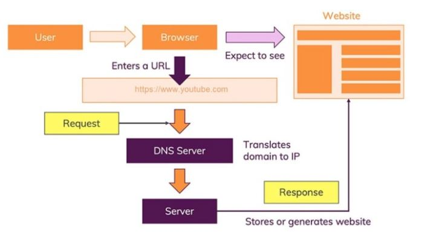
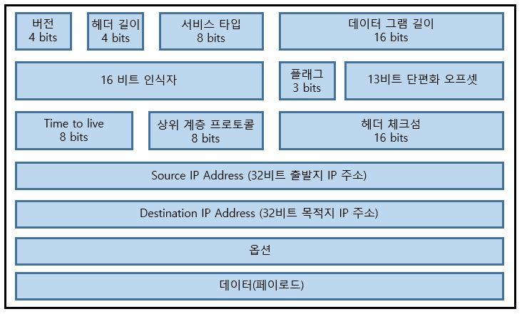
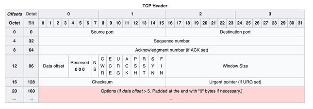
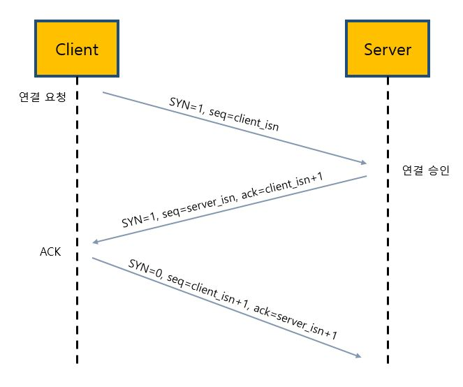

# 인터넷 프로토콜 스택 5 Layer

- __Protocol Stack__
    - 다양한 계층의 `프로토콜`을 모두 합하여 프로토콜 스택이라고 한다.
- __Protocol__
    - 프로토콜은 둘 이상의 통신 개체 간에 교환되는 메시지 포맷과 순서뿐 아니라, 메시지의 송수신과 다른 이벤트에 따른 행동들을 정의한다.
    - Ex. 발표자(A)와 발표를 듣는 스터디원 분(O)들 사이에는 어떠한 프로토콜이 존재할까?
        - 발표자 : (프로토콜 설명 중) 질문 있습니까? 
        - Others : 네 or 손을 드는 행위 (발표자에게 암시적인 메시지를 전송)
        - 발표자 : 네 말씀하세요. (질문해도 좋다라는 메시지를 전송)
        - Others : 발표자에게 질문 (발표자에게 메시지를 전송)
        - 발표자 : 질문을 듣고 (질문 메시지를 수신) -> 대답 (응답 메시지 전송)
        - 메시지의 송수신과 이들 메시지를 송수신할 때 취하는 행동에는 "`질문과 응답 프로토콜`"이 중심에 있다.
    - `네트워크 프로토콜(Network Protocol)`
        - 메시지를 교환하고 행동을 취하는 개체(Entity)가 하드웨어나 소프트웨어인 것을 제외하면 사람 간의 프로토콜과 매우 비슷하다.
        - 
            - 사용자는 인터넷에 연결된 노트북을 열고 브라우저를 연다.
            - 브라우저에서 유튜브 도메인(www.youtube.com)을 입력한다.
            - 브라우저는 DNS 서버로 이동하여 IP 주소로 교환한다.
            - 브라우저는 IP 주소를 사용하여 웹 사이트에 액세스하기 위해 유튜브 서버에 HTTP 요청을 보낸다.
            - 유튜브 서버는 HTTP 요청을 보고 데이터를 패킷 및 TCP 번호로 준비한다.
            - 유튜브 서버는 사용자 브라우저에 200 OK 상태 코드를 응답 시작 줄에 담아 응답한다.
            - TCP 는 패킷을 다시 데이터 전체로 조합하고 asset(자산)을 파싱하여 웹 페이지에 표시한다.
- __인터넷 프로토콜 스택 5 계층 구조__
    - `애플리케이션 계층(응용)`
        - HTTP(웹 문서와 요청 전송), SMTP(전자메일 전송), FTP(파일전송)
        - 애플리케이션끼리 정보 패킷을 교환할 때 이 계층을 사용, 이 계층에서 패킷을 `메시지(message)`라고 한다.
        - `TCP/IP 소켓 프로그래밍`
            - 운영체제의 Transport Layer 에서 제공하는 API 를 활용해서 통신 가능한 프로그램을 만드는 것을 의미한다.
            - 소켓 프로그래밍만으로도 클라이언트, 서버 프로그램을 따로 만들어서 동작시킬 수 있다.
            - TCP/IP 소켓 프로그래밍을 통해서 누구나 자신만의 Application Layer Encoder 와 Decoder 를 구현할 수 있다.
    - `트랜스포트 계층(전송)`
        - TCP, UDP 
        - 클라이언트와 서버 간에 애플리케이션 계층 메시지를 전송하는 서비스를 제공. 트랜스포트 계층 패킷을 `세그먼트(segment)`라고 한다.
            - 엄밀히 말하자면 인터넷 문서(RFC)에서는 TCP 에 대한 패킷을 `세그먼트(segment)`라고 정의하고 있고, UDP 에 대한 패킷을 `데이터그램(datagram)` 이라고 표현하고 있다.
        - __전송 계층을 한마디로 정의하자면 EndPoint 간 `신뢰성` 있는 데이터 `전송`을 담당하는 계층이라고 생각하면 된다.__
            - 신뢰성 : 데이터를 순차적, 안정적으로 전달
            - 전송 : 포트 번호에 해당하는 프로세스에 데이터를 전달
            - 따라서, 데이터를 받고자 하는 프로세스들은 `포트 번호(Port Number)`를 가져야 한다.
            > 포트 번호(Port Number)란 하나의 컴퓨터에서 동시에 실행되고 있는 프로세스들이 서로 겹치지 않게 가져야 하는 정수 값을 의미한다.
    - `네트워크 계층(IP)`
        - IP
        - 인터넷 네트워크 계층의 패킷을 `데이터그램(datagram)` 이라고 한다.
            - 작은 데이터그램 각각을 조각(fragment)라고 한다.
        - 한 호스트에서 다른 호스트로 데이터그램(datagram)을 `라우팅`하는 책임을 진다. 
        - `라우팅(routing)과 포워딩(forwarding)`
            - 수 많은 네트워크들의 연결로 이루어지는 인터넷 네트워크 속에서
            - 어딘가에 있는 목적지 컴퓨터로 데이터를 전송하기 위해
            - IP 주소를 이용해 길을 찾고(routing)
            - 자신 다음의 라우터에게 데이터를 넘겨주는 것(forwarding)
            > Wikipedia. 라우터(router 혹은 라우팅 기능을 갖는 공유기)는 컴퓨터 네트워크 간에 데이터 패킷을 전송하는 네트워크 장치다.
    - `데이터 링크 계층(링크)`
        - 이더넷, 와이파이 등
        - 경로상 한 노드에서 다른 노드로 패킷을 이동하기 위해, 네트워크 계층은 링크 계층 서비스에 의존해야 한다. 네트워크 계층은 데이터그램을 아래 링크 계층으로 보내고 링크 계층은 그 데이터그램을 경로상의 다음 노드에 전달한다. 링크 계층의 패킷을 `프레임(frame)`이라고 한다.
        - __같은 네트워크에 있는 여러 대의 컴퓨터들이 데이터를 주고 받기 위해서 필요한 모듈__
    - `물리 계층`
        - 네트워크 어댑터, 리피터, 네트워크 허브, 모뎀
        - 링크 계층의 기능이 전체 프레임을 한 네트워크 요소에서 이웃 네트워크 요소로 이동하는 것이라면, 물리 계층의 기능은 프레임 내부의 `각 비트(물리 계층에서 사용되는 통신 단위)`를 한 노드에서 다음 노드로 이동하는 것이다. 이 계층의 프로토콜은 링크에 의존하고 더 나아가 링크의 실제 전송 매체(Ex. 꼬임쌍선, 단일 모드 광케이블)에 의존한다.
        - `비트를 이용한 통신`
            - 비트는 0과 1로 나타내지는 전기적 온 오프 상태를 의미
            - 비트의 나열을 아날로그 신호로 바꾸어 전선으로 흘려보내고(`encoding`)
            - 아날로그 신호가 들어오면 비트의 나열로 해석하여(`decoding`)
            - `물리적으로 연결된(전선)` 두 대의 컴퓨터가 비트의 나열을 주고 받을 수 있게 해주는 모듈을 의미

- __OSI 7 Layer 와의 차이점__
    - 인터넷 프로토콜 스택은 프레젠테이션 계층(표현)과 세션 계층을 애플리케이션 계층에 포함시켰다.

## 계층을 구조화하는 이유(Layered Architecture)

네트워크는 상당히 복잡한 구조를 가지기 때문에 이를 효과적으로 분업하기 위해서 `기능별로 나누어 계층적 구조화`를 시키는 것이다. 

Layered Architecture 를 사용하면 `복잡한 시스템을 명확하고 구체적으로 구분`할 수 있고, 각 계층이 자신의 역할에 집중할 수 있게 되고, 모듈로써 제공할 수 있다.

> MVC 패턴은 소프트웨어 아키텍처 중 하나인데, Layered Architecture 로 구성되어있다. 네트워크 시스템도 마찬가지이다.

# OSI 7 Layer

OSI 7 Layer 는 인터넷 프로토콜 스택과 비슷하지만, 프레젠테이션 계층과 세션 계층이 추가되었다는 점이다.

- __Application Layer__
- __Presentation Layer__
    - 표현 계층은 코드 간의 번역을 담당하여 사용자 시스템에서 데이터의 형식상 차이를 다루는 부담을 응용 계층으로부터 덜어준다. 
    - MIME 인코딩이나 암호화 등이 이 계층에서 이루어진다.
    - 해당 데이터가 text 인지, gif, jpg 인지 구분하는 역할을 담당한다.
- __Session Layer__
    - 데이터가 통신하기 위한 논리적인 연결을 담당
    - TCP/IP 세션을 만들고 없애는 책임을 진다.
    - 통신하는 사용자들을 동기화하고 오류복구 명령들을 일괄적으로 다룬다.
- __Transport Layer__
- __Network Layer__
- __Datalink Layer__
- __Physical Layer__

사실 현재의 인터넷은 OSI 모델이 아니라 `TCP/IP` 모델을 따르고 있다. TCP/IP 모델도 OSI 모델과 마찬가지로 네트워크 시스템에 대한 모델이다. 현대의 인터넷이 TCP/IP 모델을 따르는 이유는 OSI 모델이 TCP/IP 모델과의 시장 점유 싸움에서 졌기 때문이다. 그럼에도 `OSI 7 Layer` 를 배우는 이유는 네트워크 구조를 이해하는데 도움이 되기 때문이다.

# TCP/IP Layer

TCP/IP Layer 는 사실 두 가지 버전이 있다.

- TCP/IP Original(4 Layer)
- TCP/IP Updated(5 Layer)

아래 그림을 보면서 비교해보자.

OSI 7 Layer 의 5,6,7 계층이 Application Layer 하나로 통합되었다. 1,2 게층이 Network Interface 로 통합되었다.

오늘날에는 `TCP/IP Updated` 모델이 더 많이 사용된다.

TCP/IP Updated 모델을 자세히 보면 맨 위에서 배운 `인터넷 프로토콜 스택`과 구조가 동일하다. 

"그렇습니다. 지금 바로 여러분들이 생각하고 있는 그게 맞는 생각입니다."

'컴퓨터 네트워킹 하향식 접근 제 7판' 이라는 책에서 인터넷 프로토콜 스택 5 Layer 라고 설명이 되어있고 목차가 저렇게 구성되어있는 이유는 바로 인터넷 프로토콜 스택 5 Layer 가 현대에서 사용 중인 TCP/IP Updated 을 따르기 때문이다.

"현대에서 클라이언트와 서버간의 통신을 하기위한 프로토콜로 `TCP/IP 프로토콜`을 많이 사용합니다. 아래에서는 네트워크의 통신 방식을 디테일하게 알아보기 위해 IP 와 TCP/IP 통신 방식에 대해서 배워보겠습니다."

# IP

- __IP(Internet Protocol)__
    - 네트워크에 연결된 장치들(Ex. 서버, 라우터 등)이 서로 통신하기 위한 `고유 주소`를 의미
    - `패킷(Packet)` 이라는 통신 단위로 데이터를 전달
- __IP 주소(Internet Protocol Address) : 전화번호__
    - IP 주소란 인터넷에서만 사용되는 전화번호라고 생각할 수 있다.
    - 특정 사이트를 접속하기 위해서 IP 주소를 전부 입력하라고 하면 매우 불편하고 힘들기 때문에 등장한 것이 `DNS(Domain Name System)` 즉, 인터넷 전화번호부가 등장했다.
- __DNS(Domain Name System) : 전화번호부__
    - DNS 는 도메인 이름을 IP 주소로 변환합니다.
    - 구글에 접속하기 위해 google.com 을 입력하면 DNS 를 통해 구글의 IP 주소를 찾아 이동하게 되는 것입니다. 좀 더 디테일하게 설명하자면 전화번호부 안에서도 또 다른 전화번호부를 가지고 있습니다. google.com 을 치면 가장 상위 전화번호부로 이동한 다음, 해당 전화번호부에서 goole.com 을 아는 하위 전화번호부를 알려주게 된다. 이러한 하위 전화번호부를 `registry` 라고 한다. registry 는 사기업들에 의해서 운영되며, .com registry 의 경우 미국의 Verisign 이라는 기업이 운영하고 있다.
    - 전화번호부에는 웹사이트 주소 = IP 주소 형태로 적혀있다.
    - 전화번호부는 계층형 형태로 구성되어 있으며, 하위 전화번호부를 `registry`라고 한다.
- __특징__
    - `비연결성`
        - 패킷을 받을 대상이 없거나 서비스 불능 상태여도 패킷을 전송
    - `비신뢰성`
        - 중간에 패킷이 사라지면 ? 
        - 패킷이 순서대로 안오면 ?
        - 따라서, IP 는 신뢰할 수 없는 서비스를 제공한다.

TCP/IP 5 Layer 의 Network 계층 패킷을 `데이터그램(datagram)`이라고 부른다라는 것을 배웠다. IPv4, IPv6 는 데이터그램(패킷)으로 데이터를 전송한다.

## IPv4

- __특징__
    - 32비트 방식을 사용
    - Ex. 192.168.10.1
    - `.(점)`으로 구분하며 십진 표기법(dotted-decimal notation)을 사용한다.
- __IPv4 의 데이터그램 포맷__
    - 

"되게 많은 부분들로 구성이 되어있는데 가장 중요한 부분에 대해서만 소개하겠습니다."

- __데이터(페이로드)__
    - 데이터 그램이 존재하는 이유이자 가장 중요한 마지막 필드다.

"페이로드가 중요한 이유는 `IPv4의 단편화와 재결합`의 개념을 공부하면 알 수 있습니다."

### 단편화와 재결합

링크 계층에서 네트워크 계층으로 패킷을 전달할 때 항상 같은 크기로 전달 할 순 없다.
어떤 프로토콜은 큰 데이터그램을 전달하는 반면, 다른 프로토콜은 작은 데이터그램만을 전달할 수 있다. 링크 계층 프레임이 전달할 수 있는 최대 데이터 양을 `MTU(maximum transmission unit)` 라고 부른다. MTU 는 조각(fragment, 단편)를 나누는 기준이 된다.

"단편화와 재결합을 이해하기 위해서 예시를 들어 설명하겠습니다."

- Ex. 서로 다른 A, B 라우터가 있고  A -> B 로 데이터그램을 보낸다고 가정
    - 전제. B 의 MTU 가 A 보다 작다.
    - 그러면 A 에서 데이터그램을 자신의 MTU 최대로 해서 보내게되면 B 에서는 어떻게 받아서 짜맞추고 처리해야할지 난감하다.
    - 이러한 문제를 해결하고자 IP 데이터그램의 페이로드를 작게 `분할`하고 -> 분할된 데이터그램을 캡슐화하여 출력 링크로 보낸다.
    - 이렇게 분할되어 작아진 데이터그램 각각을 `조각(fragment, 단편)`이라고 한다.

"이렇게 잘린 단편(fragment)들은 전송 계층(Transport Layer)에 도달하기 전에 재결합 되어야 합니다."

목적지 호스트(Destination Host)에서 `재결합`을 잘 수행하기 위해 내부적으로 `식별자, 플래그, 단편화 오프셋` 필드를 IP 데이터그램 헤더에 찍어 넣었다. IP 자체는 신뢰할 수 없는 서비스를 제공하기 때문에 패킷이 중간에 사라지거나 제대로 오지 않을 수 있다. 이러한 이유로 목적지 호스트가 원본 데이터그램의 마지막 조각을 수신했음을 확신하기 위해 마지막 데이터그램 조각의 플래그 비트는 0으로, 다른 조각들의 플래그 비트는 1로 설정한다.

__프래그먼트(fragment, 단편)을 이용하는 곳에서는 단편화가 발생한다. TCP 는 세그먼트(segment)라는 것을 이용해서 단편화가 발생하지 않는다. 반면 UDP 는 를 사용하기 때문에 단편화가 발생한다.__

## IPv6

- __특징__
    - 128비트 방식(16비트씩 8자리로 구성)
    - Ex. 2001:0DB8:1000:0000:0000:0000:1111:2222
    - 32비트에서 128비트로 확장이되어, 행성의 모든 모래알 마저도 IP 주소로 표현할 수 있다.
    - IPv6 는 `애니캐스트 주소(anycast address)`가 도입되었는데, 애니캐스트 주소로 명시된 데이터그램은 호스트 그룹의 어떤 이에게도 전달될 수 있다고 한다.
        - Ex. 주어진 문서를 포함한 수 많은 미러 사이트 중에서 가장 근접한 HTTP GET 을 보내는 데 사용
- __IPv6 의 데이터그램 포맷__
    - 

# TCP, UDP

TCP 와 UDP 는 전송 계층(Transport Layer)에 속하며, 네트워크 애플리케이션을 설계할 때 둘 중 하나를 선택해야 한다. UDP(User Datagram Protocol)은 비 신뢰적이고 비 연결형인 서비스를 제공하며 TCP(Transport Control Protocol)는 `신뢰적`이며 `연결지향형` 서비스를 제공한다.

## TCP 

- __특징__
    - 연결지향 - `TCP 3 way handshake` : 양방향 연결방식
    - 데이터 전달 보증
    - 순서 보장
    - 신뢰할 수 있는 프로토콜
    - 현재는 대부분 TCP 사용
- __주로 사용 되는 애플리케이션__
    - 속도보다 `신뢰성이 중요`하다고 판단되는 곳에서는 대부분 TCP 가 사용된다고 생각하면 된다.
    - SMTP(전자메일)
    - Telnet(원격 터미널 접속)
    - HTTP(웹)
    - FTP(파일 전송)

"TCP 3 way handshake 를 배우기 전에 TCP 연결의 특징 2가지에 대해서 짚고 넘어가겠습니다."

- __TCP 연결 특징__
    - `전이중(full-duplex)` 서비스 제공
        - A, B 프로세스 사이에 TCP 연결이 있다면, 데이터는 A->B, B->A 로 동시에 흐를 수 있다. 이러한 특징을 전이중 서비스라고한다.
    - `점대점(point-to-point)` 
        - 단일 송신 동작으로 한 송신자가 여러 수신자에게 데이터를 전송하는 `멀티캐스팅`은 TCP 에서 불가능하다.
    - `TCP 3 way handshake` 사용
        - TCP 연결 절차를 '세 방향' 핸드셰이크라고 부른다.
    - `세그먼트(segment)` 사용
        - 세그먼트의 크기는 `최대 세그먼트 크기(maximum segment size, MSS)`로 제한된다.
            - 즉, MSS 가 세그먼트를 나누는 기준이된다.
        - MSS 는 MTU 에 의해 결정된다.

### TCP 세그먼트 구조

"중요하게 볼 부분은 출발지 포트번호와, 목적지 포트번호를 가진다는 점과 `ACK, SYN, FIN` 정도 입니다."

### TCP 3 way handshake

TCP 는 IP 가 처리할 수 있도록 데이터를 여러 개의 패킷으로 나누고 도착지에서는 완전전한 데이터로 패킷들을 재조립 해야 한다.

- SYN : 접속 요청(패킷 송신)
- ACK : 요청 수락(패킷을 받았다고 응답)
- FIN : 접속이 연결되었을 때, 끊어야 할 때 사용하는 FLAG BIT

1. 클라이언트가 서버에 연결 요청을 할 때 SYN 이라는 플래그 비트와 최초의 순서번호(client_isn)를 선택한다. 그리고 최초의 TCP SYN 세그먼트의 순서번호 필드에 이 번호를 넣는다. 이 세그먼트는 IP 데이터그램 안에서 캡슐화되고 서버로 송신된다.
2. TCP SYN 세그먼트를 포함하는 IP 데이터그램이 서버에 도착하면, 서버는 데이터그램으로부터 TCP SYN 세그먼트를 뽑아낸다. 그리고 TCP 버퍼와 변수들을 할당한다음 TCP 로 연결 승인 세그먼트를 송신한다. 확인 응답 필드인 ACK 에 client_isn 을 +1 하여 보낸다. 이러한 연결 승인 세그먼트는 `SYNACK 세그먼트`라고도 불린다. 여기서 클라이언트가 ACK 을 수신하지 못하면 클라이언트가 패킷을 다시 서버로 재전송한다.
3. 클라이언트가 서버로 연결이 설정되었다는 것을 응답하기 위해 SYN 을 0 으로 바꿔 보낸다. 이때 데이터까지 같이 보낼 수 있다.

이렇게 연결이 완료되면(SYN 과 ACK 을 수신하고 ACK 을 전송) 상태 값은 `ESTABLISHED`가 된다.

TCP 연결이 있다면 연결 종료도 있어야 한다. 연결 종료는 `TCP 4 way handshake`라고 불리며 ESTABLISHED 상태에서 시작된다.

### TCP 4 way handshake

1. 데이터를 전부 송신한 클라이언트가 서버로 FIN 을 송신
2. 서버가 ACK 을 송신
3. 서버에서 남은 패킷 송신(일정 시간 대기)
4. 서버가 FIN 송신
5. 클라이언트가 ACK 송신

### TCP 의 문제점

- 매번 커넥션을 연결해서 시간 손실 발생(3 way handshake)
- 패킷을 조금만 손실해도 재전송

## UDP

TCP 와는 다르게 데이터를 패킷([datagram](http://www.ktword.co.kr/test/view/view.php?m_temp1=634&id=418))으로 나누고 반대편에서 재조립하는 과정을 거치지 않으며 수신지에서 제대로 받던 받지 않던 상관 안하고 데이터를 보내기만 한다. 

- __주로 사용 되는 애플리케이션__
    - NFS(원격 파일 서버) -> 주로 UDP
    - DNS -> 주로 UDP
        - DNS 가 UDP 로 주로 사용되는 이유 ?
            - TCP 의 연결 설정 지연을 피하기 위해
            - 연결 상태를 유지할 필요가 없음
            - 신뢰성보단 속도가 중요하기 때문

- __장점__
    - TCP 보다 신뢰성은 떨어지지만 전송 속도는 빠르다.
- __특징__
    - 사용자 데이터그램 프로토콜(User Datagram Protocol)
    - 하얀 도화지에 비유(기능이 거의 없음)
    - 단방향 연결
    - 비연결성(No Handshaking)
    - 비신뢰성
    - 데이터 전달 보증 X
    - 순서 보장 X
    - 재결합 X
    - `데이터 전달 및 순서가 보장되지 않지만, 단순하고 빠름`
    - `IP와 거의 같다. +PORT +체크섬 정도만 추가`
    - 애플리케이션에서 추가 작업 필요
    - 영상 스트리밍 같은 곳에서 주로 사용

# PORT

포트는 같은 IP 내에서 `프로세스를 구분`하기 위한 것입니다.

- 192.168.10.1
  - Ex. 게임 : 8090
  - Ex. 화상통화 : 21000
  - Ex. 웹브라우저 : 10010

포트는 일반 적으로 세 가지로 나눌 수 있습니다.

- 0 ~ 1023 : 잘 알려진 포트(Well Known Port)
- 1024 ~ 49151 : 등록된 포트(Registered Port)
- 49152 ~ 65535 : 동적 포트(Dynamic Port)

유닉스 체제의 경우 잘 알려진 포트에 대해 방화벽을 해제하려면 루트 권한이 필요합니다.

## References

> [How Does The Web Work](https://webdevtechblog.com/%EC%9B%B9%EC%9D%80-%EC%96%B4%EB%96%BB%EA%B2%8C-%EB%8F%99%EC%9E%91%ED%95%A0%EA%B9%8C-how-does-the-web-work-90c2286c9f4)
>
> [컴퓨터 네트워킹 하향식 접근 제 7판](http://www.kyobobook.co.kr/product/detailViewKor.laf?mallGb=KOR&ejkGb=KOR&barcode=9791185475318)
>
> https://jhnyang.tistory.com/373
>
> https://hwan-shell.tistory.com/271
>
> https://bnzn2426.tistory.com/64
>
> [히히의 OSI 7 Layer](https://www.youtube.com/watch?v=1pfTxp25MA8&list=PLgXGHBqgT2TvpJ_p9L_yZKPifgdBOzdVH&index=120)
>
> [르윈의 TCP, UDP](https://www.youtube.com/watch?v=ikDVGYp5dhg&list=PLgXGHBqgT2TvpJ_p9L_yZKPifgdBOzdVH&index=165)
>
> http://www.ktword.co.kr/test/view/view.php?m_temp1=323
