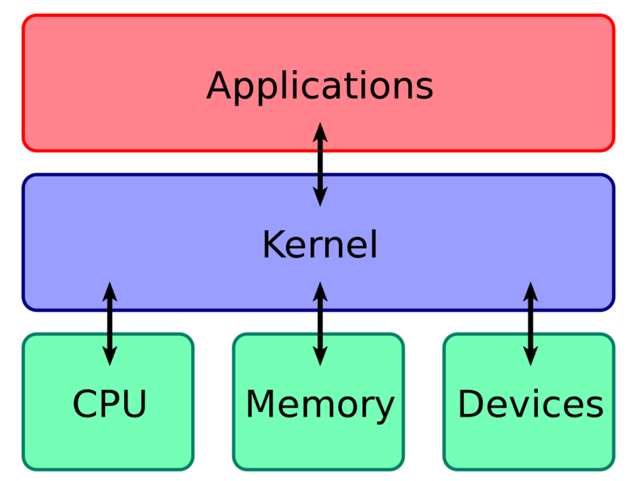

## 커널
- 커널(Kernel)의 사전적 의미는 "핵심" 이다.  
- 하드웨어와 프로세스를 연결하는 핵심 인터페이스  
- 커널은 소프트웨어와 하드웨어를 연결해준다.



- 커널의 기능
    - 프로세스 관리 : 프로세스의 생성 및 제거를 담당. 스케줄러를 이용하여 여러 프로세스 동작을 제어한다.
    - 메모리 관리 : 각 프로세스가 독립적으로 사용할 수 있는 가상 주소 공간을 제공.
      - 가상 주소 공간 : 프로세스가 실행되는 물리 메모리의 실제 주소를 가리키는 주소들의 집합, 가상 주소를 물리 주소로 매핑하며 실행이 된다.
    - 파일 시스템 관리 : 시스템에 동작하는 모든 자원을 파일처럼 다룰 수 있도록 인터페이스를 제공한다.

## 커널모드와 유저 모드
1. 커널 모드 (Kernel mode)
    - 모든 하드웨어에 대한 접근이 가능
    - 모든 주소 공간에 접근이 가능
    - 프로세스 제어, 파일 조작, 장치(I/O, 타이머) 조작 등의 명령을 할 수 있다.
    - 유저모드보다 더 높은 권한이 필요함. (관리자 권한)
2. 유저 모드
    - 사용자가 접근할 수 있는 영역
    - `코드 영역, 데이터 영역, 스택 및 힙 영역` 을 가리켜 유저 영역 이라고 한다.
    - 유저 어플리케이션의 코드가 유저 모드에서 실행된다
3. 유저 모드와 커널 모드 간 전환
    - 유저 모드 -> 커널 모드
        - 프로세스가 유저 모드에서 실행되다가 특별한 요청이 필요할 때 system call 을 이용하여 커널에 요청
    - 커널 모드 -> 유저 모드
        - system call 요청을 수행하고, 결과값을 system call 의 리턴 값으로 전환하며 유저모드로 돌아감
4. 두 가지 모드가 있는 이유?
    - 하드웨어의 보안을 유지하기 위해서


## 커널과 관련된 Q&A
1. 커널은 스스로 실행되는 프로세스인가?
    - 시스템 호출을 통해 호출되는 단순 함수, 데이터의 집합
2. 커널은 스택이나 힙을 가지고 있나?
    - 없다. 프로세스/스레드가 스택과 힙을 소유하고 있다.
    - 커널은 하나의 프로세스가 아니므로 자신만의 스택과 힙을 가지고 있지 않다. 사용자가 system call 을 통해 간접적으로 커널 함수를 호출하게 되면,
      현재 커널 코드 실행을 위해 임시로 커널 영역에 stack 이 생성될 수는 있다.  하지만 이는 커널이 관리하는 공간이 아니다. system call 이 끝나면 사라진다.


<br>
<br>


## 시스템 콜 (System Call)
`운영 체제가 응용 프로그램에게 제공하는 인터페이스`  
인터럽트 중 하나이다.

<br>
<br>

## 시스템 콜은 왜 필요한가?  
운영체제는 커널 모드(Kernel Mode)와 사용자 모드(User Mode)로 나뉘어 구동된다.  
운영체제에서 프로그램이 구동되는데 있어 파일을 읽고, 쓰고, 혹은 화면에 메시지를 출력하는 등 많은 부분이 커널 모드를 사용한다.   
시스템 콜은 이러한 커널 영역의 기능을 사용자 모드가 사용 가능하게 해준다.

<br>
<br>

## 시스템 콜 호출 과정
1. 사용자 프로세스에서 시스템 콜 중 하나인, `fork()` 시스템 콜을 호출한다고 가정해봅시다.
- 참고
  - 각 시스템 콜은 각각의 고유 번호를 가지고 있다.
  - fork() 시스템 콜의 고유 번호 : 2
2. C 라이브러리인 `lib.a` 에서 `fork()` 고유번호인 2를 `eax 레지스터`에 저장하고 `0x80 인터럽트`를 발생시킨다.
- 참고
  - eax 레지스터
    - Extended Accumulator Register
    - 범용 레지스터 중 하나
    - 용도 : `산술 연산, 논리 연산`을 수행 할 때 사용
    - 왜 eax 에 시스템 콜 고유번호를 저장할까?
      - 생각해봤더니, eax레지스터에 4 또는 8을 `곱한 값`을 이용하여 시스템 콜 테이블 내부의 특정 주소에 해당하는 시스템 콜을 조회할 때 사용되기 때문이다. 
      - 실제로 시스템 콜 테이블에는 시스템 콜들이 long 타입으로 정의되어있다.
        - 예시) `long sys_write` , `long sys_fork`
      - long 타입은 32 비트 운영체제에선 4 바이트, 64 비트 운영체제에선 8 바이트이다.
      - 4를 곱하는 경우 : 32 비트 운영 체제
      - 8을 곱하는 경우 : 64 비트 운영 체제
      - 정리 : 64비트 운영체제 기준, `fork()` 시스템 콜을 찾기 위해서는 eax 에 2를 저장하고, 이후에 8 을 곱한 16이라는 주소를 이용하여 `long sys_fork` 에 접근 할 수가 있다.  
```c
#L1ENTRY(sys_call_table) 
.long sys_restart_syscall // 0번째 주소
.long sys_exit            // 8번째 주소
.long sys_fork            // 16번째 주소
.long sys_read            // 24번째 주소
.long sys_write           // 32번째 주소
```

3. 현재 실행중인 프로세스가 중단 되며, 현재까지 수행중이었던 상태를 해당 프로세스의 `PCB ( Process Control Block )` 에 저장하고, 발생한 인터럽트 번호(`0x80`) 를 `IDT 또는 IVT` 에서 확인하여 해당 함수를 호출한다.
- 참고
  - IDT / IVT
    - IDT 는 인텔에서 IVT 를 부르는 이름 이라고 한다.
    - Interrupt Descriptor Table / Interrupt Vector Table
    - 인터럽트 상황이 왔을 때, 실행할 인터럽트들의 실행코드를 가리키는 주소가 담겨있는 구조체 
    - 커널 초기화 될 때, IDT 에 인터럽트들이 등록된다.
    - IDT 의 위치는 IDTR (IDT Register) 의 내용을 확인하여 알 수 있다.
    - IDTR 에 IDT 의 시작 번지와 엔트리 갯수가 저장되어 있다.
  - Interrupt Vector
    - 인터럽트가 발생 했을 때, 그 인터럽트를 처리할 수 있는 루틴의 주소를 가지고 있는 공간
    - 인터럽트에 대한 `ISR`의 시작 주소를 가지고 있다.
    - ISR(Interruct Service Routine) : 실제 인터럽트를 처리하는 루틴


4. IDT 의 0x80 주소에는 `system_call()` 인터럽트가 등록되어 있어서, `system_call` 이 실행 되는데, 이 때 `system_call_table` 을 참조하여 `eax 레지스터` 에 저장된 값을 읽어 해당하는 `system_call( 여기서는 fork() )` 을 실행한다. 
5. ISR 끝에 `RETI` 라는 인터럽트 해제 명령어가 있어서 시스템 콜 실행이 종료 되며, 이 명령어가 실행되면 실행이 중단되었던 프로세스의 `PCB` 에서 `PC` 값을 읽어서 이전 실행 위치로 복원이 되고, CPU 레지스터들을 초기화 시켜주면서 중단되었던 프로세스를 다시 수행한다.


<br>
<br>


## 시스템 콜의 유형
1. 프로세스 제어 (Process Control)

   - 끝내기(end), 중지(abort)
   - 적재(load), 실행(execute)
   - 프로세스 생성(create process)
   - 프로세스 속성 획득과 설정(get process attribute and set process attribute)
   - 시간 대기(wait time)
   - 사건 대기(wait event)
   - 사건을 알림(signal event)
   - 메모리 할당 및 해제 : malloc, free 

2. 파일 조작 (File Manipulation)
   - 파일 생성(create file), 파일 삭제(delete file)
   - 열기(open), 닫기(close)
   - 읽기(read), 쓰기(write), 위치 변경(reposition)
   - 파일 속성 획득 및 설정(get file attribute and set file attribute)

3. 장치 관리(Device Management)
   - 장치를 요구(request devices), 장치를 방출(release device)
   - 읽기, 쓰기, 위치 변경
   - 장치 속성 획득, 장치 속성 설정
   - 장치의 논리적 부착(attach) 또는 분리(detach)

4. 정보 유지(Information Maintenance)
   - 시간과 날짜의 설정과 획득(time)
   - 시스템 데이터의 설정과 획득(date)
   - 프로세스 파일, 장치 속성의 획득 및 설정
5. 통신(Communication)
   - 통신 연결의 생성, 제거
   - 메시지의 송신, 수신
   - 상태 정보 전달
   - 원격 장치의 부착 및 분리
   - 메시지 전달 : 두 프로세스의 통신에 정보 교환을 위한 메시지
   - 공유 메모리 : 다른 프로세스가 소유한 메모리에 접근을 위해 특정 시스템 콜 호출


## Reference
- https://nekoplu5.tistory.com/139
- https://velog.io/@tnddls2ek/OS-%EC%9D%B8%ED%84%B0%EB%9F%BD%ED%8A%B8-Interrupt#%EC%9D%B8%ED%84%B0%EB%9F%BD%ED%8A%B8%EC%99%80-idt-interrupt-descriptor-table