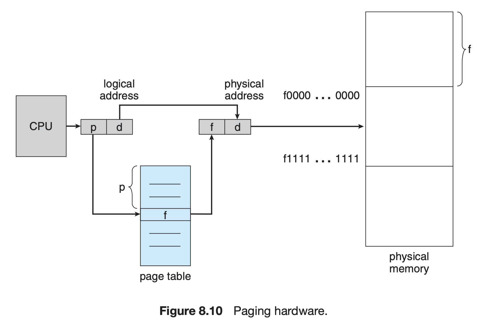
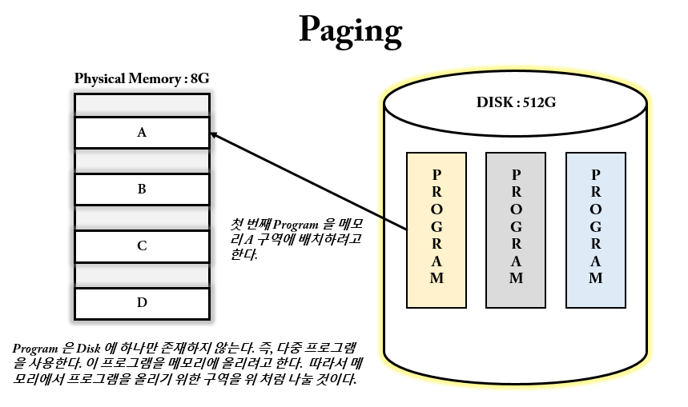
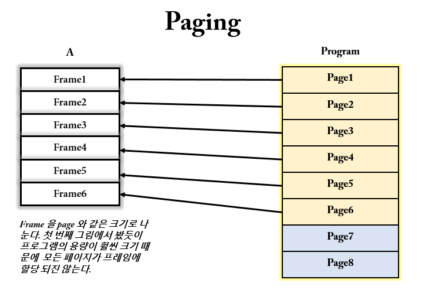
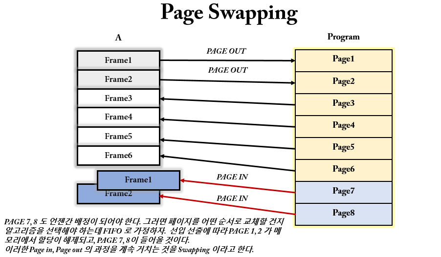

# 세그멘테이션과 페이징

세그멘테이션과 페이징 발표 자료를 준비하는데 사실 양이 얼마 없을 줄 알고 좋아했다.. 하지만 정작 세그멘테이션과 페이징를 배우기 위해서는 선수 지식들이 필요해서 이번 발표 자료 양도 많아졌다.

세그멘테이션과 페이징을 배우기 전에 `메모리 할당과 단편화`에 대한 지식이 부족하면 배우고 오자.

## 세그멘테이션(Segmentation)

세그멘테이션은 프로그래머가 인지하는 메모리의 모습을 실제 메모리의 모습(Ex. 프로세스의 메모리 구조)으로 변환해주는 메모리 기법을 제공한다. 

세그먼테이션은 프로세스를 세그먼트(segment)의 집합으로 만든다. 각 세그먼트의 크기는 일반적으로 같지 않다. 프로세스를 code, data, stack & heap 으로 나누는 것 역시 세그먼테이션의 모습이다. 물론 code, data, stack & heap 각각 내부에서 더 작은 세그먼트로 나눌 수도 있다.

세그먼테이션을 위한 테이블을 세그먼트 테이블이라고한다. 그리고 세그먼트 테이블은 `세그먼트 번호`와 `시작 주소(base)`, `세그먼트 크기(limit)`를 엔트리로 갖는다. 세그먼트 크기를 갖는 이유는 세그먼트의 크기가 일정하지 않기 때문이다.

위 그림은 세그먼트 테이블과 프로세스가 할당된 메모리의 모습이다. 0 부터 4까지의 번호를 가진 5개의 세그먼트가 있다. s 는 세그먼트의 번호를 의미하며 세그먼트 테이블에 대한 색인으로 사용된다. d 는 변위(offset)를 의미한다. 그림을 보면 d 는 논리 주소와 물리 주소가 동일하다. (왼쪽이 논리 주소, 오른쪽이 물리 주소)

- 논리주소는 `v = (s,d)` 로 표현된다.
    - 논리주소 (2, 100) -> 물리주소 4400번지
    - 논리주소 (1, 500) -> 인터럽트로 인해 프로세스 강제 종료(범위를 벗어남)
- 물리주소 a 는 `base[s] + d` 로 계산된다.

### 장점

- __보호와 공유 면에서 효과적이다.__
    - 두 user process가 동일한 코드(text segment)를 공유하기 용이.
    - 각 memory section 들에게 각기 다른 read/write 권한 설정할수있음
    - 내부 단편화가 발생하지 않는다.

### 단점

- __세그먼트 크기는 가변적이기 때문에 외부 단편화가 발생할 수 있다.__

## 페이징

페이징은 프로세스와 메모리 hole 을 작은 크기로 나눠서 외부 단편화를 해결하는 문제이다. 잘린 프로세스 조각들을 `page`라고 하고 물리 메모리를 나눈 조각을 `frame`이라고 한다. 이 frame 은 page 와 같은 크기를 가진다. 즉, 고정 분할 방식을 사용한다고 할 수 있다. 따라서, 메모리는 프레임의 집합이고, 프로세스는 페이지의 집합이라고할 수 있다.

- __메모리__
    - Frame set
- __프로세스__
    - Page Set

프로세스 단위의 메모리 할당방식에서는 `프로세스 : hole = 1 : 1` 방식으로 할당되었다면 페이징에서는 `page : frame = 1 : 1` 방식으로 할당된다. 

CPU 에서 나오는 모든 주소(논리 주소 또는 가상 주소 라고한다.)는 `페이지 번호(p)`와 `변위(d: offset)` 으로 나누어진다. 페이지 번호는 페이지 테이블(page table)을 접근(access)할 때 사용되며 페이지 테이블은 주 메모리에서 각 페이지가 점유하는 주소를 가지고 있다. 

물리 주소는 `프레임 번호(f)`와 `변위(d: offset)` 을 가진다.

세그멘테이션에서 본 메모리 할당 그림처럼, 페이징도 페이지 주소에 변위를 더하면 원하는 물리 주소가 된다.

페이징에서는 내부 단편화가 발생한다. 만약 프로세스가 페이지 프레임의 경계와 일치하지 않는 크기의 메모리를 요구하면 마지막 페이지 프레임에 할당이 되지 않을 것이다. (위에서 배운 내부 단편화를 생각하면 편하다.)

- `페이지` : 가상 메모리를 최소 단위로 쪼개어 만든 일정한 크기의 블럭
- `프레임` : 물리 메모리에 페이지 크기와 같은 블럭으로 나눈 블럭
- CPU 가 가상 주소 접근 시 MMU(Memory Management Unit) 가 페이지 테이블의 시작(base) 주소를 접근해서 물리주소 가져 옴

> 가상 메모리란 물리 메모리 크기의 한계를 극복하기 위해 나온 기술로 메모리가 실제 메모리보다 많아 보이게 하는 기술을 의미한다.

### 페이지 스와핑(Swapping)

스와핑은 가상 기억 장치 기술에서 페이지를 올리고 내리고 빈번하게 일어나는 작업을 의미한다. 위에서 배웠던 프로세스 스와핑이랑 차이점은 단위가 다르다는 것이다. 페이징에서의 스와핑은 단위가 `페이지(Page)`이고 프로세스에서의 스와핑은 단위가 `프로세스(Process)`인 것이다.

### 페이지 테이블(TLB)

MMU 는 `페이지 테이블(TLB, Translation Lookaside Buffer)`이라는 소형 하드웨어 캐시를 저장하고 있다. 대부분의 컴퓨터는 페이지 테이블의 크기가 엄청 클 것이다. 따라서, 페이지 테이블을 이용해서 가상 주소와 물리 주소로 변환되는 과정을 효과적으로 하기 위해 등장한 것이 TLB 이다.

- 가상 주소가 물리 주소로 변환되어야할 때, `TLB 에서 우선 검색`한다. 해당 되는 주소가 있으면(TLB hit) 물리주소가 리턴되고 메모리에 접근한다.
- TLB 에서 해당되는 주소가 없을 경우 (TLB miss) `page table 에서 맵핑이 존재`하는지 찾는다.
- 존재할 경우에(page table hit) 이 값은 다시 TLB 에 쓰이고 그 주소를 이용해 물리 주소로 변환 후, 메모리에 접근한다.
- page table 에서도 찾지 못할 경우에는 `disk` 에서 찾고, 그 값을 다시 page table 과 TLB 에 쓰고 물리주소로 변환 후 메모리에 접근한다.

TLB 내의 각 항목은 `KEY 와 VALUE` 로 구성된다. TLB 에 페이지를 찾아달라고 요청이 들어오면 이 찾고자 하는 페이지를 동시에 여러 개의 내부 키(페이지 번호)와 비교하고, 페이지 번호가 같은 것이 발견되면 프레임 번호를 알려준다.

### 특징

- 페이징에서 블록의 크기는 `고정적`이다.
- 페이지 크기가 작을 수록 `내부 단편화` 크기는 줄어든다.
- 페이지 크기가 작을 수록, 꼭 필요한 사용을 하므로 `유용성`이 좋아진다.
    - Ex. 운영 체제 책을 예로 들면 챕터별로 구성이 된다.(컴퓨터 구조, 파일, 메모리 관리, 스케줄링 등) 여기서 우리가 배울것은 메모리 관리이다. 만약에 페이지 크기가 커서 다음과 같이 챕터가 구성되어있다고 해보자. (컴퓨터구조, 파일+메모리관리, 스케줄링 등) 우리가 배울 건 메모리 관리만 배우면되는데 불필요한 파일까지 있게 되는 셈이다.
    - 즉, 페이지 크기를 크게 쪼개면 지금 당장 사용하지 않을 코드들이 페이지안에 존재하게되면 불필요한 정보까지 메모리에 올리게 되는 셈이니 유용성가 떨어진다.
- 페이지 크기가 작을 수록 `페이지 부재`가 증가한다.
    - 페이지 부재(Page Fault)는` CPU 에서 요청한 페이지가 메모리에 없는 경우`를 말한다.
- 페이지 크기가 작을 수록 자주 사용하는 `페이지의 집합(Working Set)`을 효율적으로 운영할 수 있다.
    - 페이지의 집합이란 말 그대로 페이지들의 집합이다.
    - Frame 에 Page 가 할당될때 분명 자주 사용되는 페이지들이 있을 것이다. 얘네들을 교체 대상에서 제외시킨다는 지 이런식으로 운영할 수 있다.
- 페이지 크기가 작을 수록 특정한 구역성(locality)(참조 지역성이라고 표현하기도 함)만을 포함하기 때문에 기억장치 효율이 좋을 수 있다.
- 페이지 크기가 클 수록 참조되는 정보와는 무관한 많은 양의 정보가 주기억장치에 남게 된다.
- 페이지 크기가 클 수록 페이지 테이블이 복잡하지 않아서 관리가 용이하다.
- 페이지 크기가 클 수록 하나의 페이지를 디스크로부터 입출력하는데 소모되는 시간이 커지게 된다.
    - Ex. `4K: 14개, 10K : 6개` 형식으로 분할했다고하면 당연히 6개짜리에서 각 페이지를 교체하는데 시간이 더 걸린다. 
    - 반면, 페이지 크기가 작으면 `총 입출력 시간(Swapping 하는데 총 걸리는 시간들)`은 늘어난다. 페이지 크기가 크면 페이지 부재가 더 적게 일어나기 때문에 단일 페이지를 교체하는 시간은 더 크더라도 총 시간으로 비교하면 더 적다.

## References

- [운영체제 9th edition](http://www.kyobobook.co.kr/product/detailViewKor.laf?mallGb=KOR&ejkGb=KOR&barcode=9788998886813)
- [https://velog.io/@adam2](https://velog.io/@adam2/OS%EA%B8%B0%EC%B4%88%EB%A9%94%EB%AA%A8%EB%A6%AC-%EA%B4%80%EB%A6%AC%EC%A3%BC%EC%86%8C-%EB%B0%94%EC%9D%B8%EB%94%A9)
- https://www.geeksforgeeks.org/paging-in-operating-system/
- https://dnr2144.tistory.com/94
- https://neos518.tistory.com/120
- https://jhnyang.tistory.com/133
- https://jhnyang.tistory.com/103
- https://velog.io/@codemcd/%EC%9A%B4%EC%98%81%EC%B2%B4%EC%A0%9COS-14.-%EC%84%B8%EA%B7%B8%EB%A9%98%ED%85%8C%EC%9D%B4%EC%85%98
- https://wansook0316.github.io/cs/os/2020/04/06/%EC%9A%B4%EC%98%81%EC%B2%B4%EC%A0%9C-%EC%A0%95%EB%A6%AC-14-%ED%8E%98%EC%9D%B4%EC%A7%95.html
