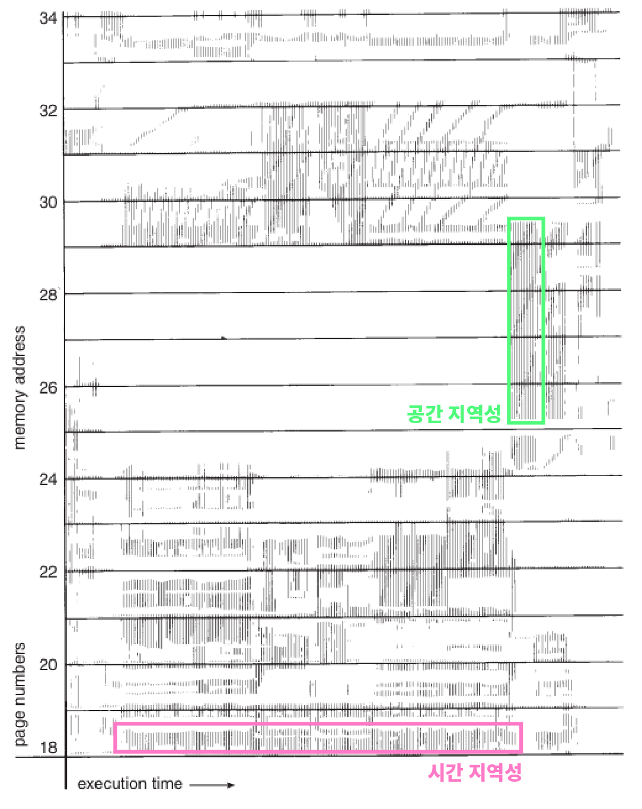
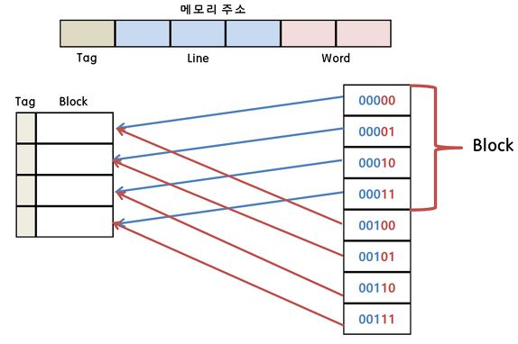

## 캐시의 지역성

### 캐시란?

캐시 메모리는 속도가 빠른 장치와 느린 장치간의 속도차에 따른 병목 현상을 줄이기 위한 범용 메모리이다.  
CPU가 주기억장치 메모리에 접근하기 전에 캐시 메모리에서 원하는 데이터 존재 여부를 확인하는데, 이때 필요한 데이터가 있는 경우 Hit(적중), 없는 경우 Miss(실패)라고 한다.  
요청한 데이터를 캐시 메모리에서 찾을 확률은 Hit Ratio(적중률)이라고 한다.  
캐시 메모리의 성능은 적중률에 의해 결정된다.

### 캐시의 종류
- L1 Cache

프로세서와 가장 가까운 캐시  
속도를 위해 IC와 DC로 나뉜다.
> IC(Instruction Cache) : 메모리에서 text 영역의 데이터를 다루는 캐시  
> DC(Data Cache) : 메모리에서 text 영역을 제외한 데이터를 다루는 캐시

- L2 Cache

용량이 크다.
크기를 위해 L1 Cache와 같이 나누지 않는다.

- L3 Cache 

멀티 코어 시스템에서 코어가 공유하는 캐시

### 캐시의 지역성 원리

이러한 역할을 수행하기 위해서는 CPU가 어떤 데이터를 원할 것인가를 어느정도 예측할 수 있어야 한다.  
캐시의 성능은 작은 용량의 캐시 메모리에 CPU가 이후에 참조할, 쓸모 있는 정보가 어느 정도 들어있느냐에 따라 좌우되기 때문이다.  
이 때 적중율(Hit rate)을 극대화 시키기 위해 데이터 지역성(Locality)의 원리 를 사용한다.  
지역성의 전제조건으로 프로그램은 모든 코드나 데이터를 균등하게 Access 하지 않는다는 특성을 기본으로 한다.  
즉, Locality란 기억 장치 내의 정보를 균일하게 Access 하는 것이 아닌 어느 한 순간에 특정 부분을 집중적으로 참조하는 특성인 것이다.  
이 데이터 지역성은 대표적으로 시간 지역성(Temporal Locality)과 공간 지역성(Spatial Locality)으로 나뉜다.
- 시간 지역성 : 최근에 참조된 주소의 내용은 곧 다음에 다시 참조되는 특성
- 공간 지역성 : 대부분의 실제 프로그램이 참조된 주소와 인접한 주소의 내용이 다시 참조되는 특성

가로 축은 실행시간이고, 세로축은 메모리 주소다.  
즉, 수평으로 이어진 참조 기록은 긴 시간에 걸쳐 같은 메모리 주소를 참조한 것이고, 수직으로 이어진 참조 기록은 같은 시간에 밀접한 메모리 주소들을 참조한 것이다.

### 전송 단위

- 워드 (word)

CPU의 기본 처리 단위이며, 블록/라인을 구성하는 기본 단위이다.

- 블록 (block)

메모리를 기준으로 잡은 캐시와의 전송 단위이다.  
캐시 라인과 크기가 같으며, 메모리 블록은 여러 개의 워드로 구성되어 있다.  

- 캐시라인 (cache-line)

메모리 블록과 동일한 크기의 캐시 관점의 캐시 - 메모리 간의 전송 단위이다.  
캐시는 여러개의 캐시 라인으로 이어져 있으며 각 라인은 여러개의 워드로 구성되어있다.  
> 메인 메모리의 내용을 캐시에 저장하기 위해서 메인메모리의 데이터를 읽어와야 한다.  
이 때, 읽어들이는 최소 단위를 캐시라인(cache-line)이라 하며, 이렇게 읽어들인 데이터는 캐시의 data block을 구성하게 된다.

### Mapping Function

CPU가 메모리 주소를 사용하여 메모리로 데이터를 받으려고 한다.  
하지만 CPU가 쓰는 주소는 가상 메모리 주소로 메모리 입장에서는 외계어이다.  
따라서 중간에 메모리 관리 장치(MMU)가 가운데에서 번역을 하여 메모리가 알 수 있는 물리주소로 변환해준다.  
그리고 캐시에 해당 주소에 대한 데이터가 있는지 확인을 하는데 캐시에 데이터를 저장하는 방식에 따라 물리주소를 다르게 해석할 수 있다.

- 직접 매핑 (Direct Mapping)

우선 메인 메모리에서 캐시로 데이터를 저장할 때 캐시의 지역성 때문에 한번 퍼낼 때 인접한 곳까지 한꺼번에 캐시 메모리에 저장하고 이 때 단위를 블록(Block)라고 한다.
그리고 캐쉬는 메인 메모리의 몇번째 블록인지를 알려주는 태그(Tag)도 함께 저장한다.  

직접 매핑은 위의 사진처럼 캐시에 저장된 데이터들은 메인 메모리에서와 동일한 배열을 가지도록 매핑하는 방법을 말한다.
매우 단순하고 탐색이 쉽다는 장점이 있지만 적중률(Hit ratio)가 낮다는 단점이 있다. 반복문을 사용할 건데 같은 라인의 00000을 불렀다가 그 다음엔 00100을 부른다면
캐시에 빈번하게 변경이 발생할 수 있기 때문이다.

- 연관 매핑 (Associative Mapping)

연관 매핑은 직접 매핑의 단점을 보완하기 위해 등장하였다. 캐시에 저장된 데이터들은 메인 메모리의 순서와는 아무런 관련이 없다.  
이와 같은 방식을 사용하기 때문에 캐시를 전부 뒤져서 태그가 같은 데이터가 있는지 확인해야 한다.  
따라서 병령 검사를 위해 복잡한 회를 가지고 있는 단점이 있지만 적중률이 높다는 장점이 있다.

- 세트 연관 매핑 (Set Associative Mapping)

직접 매핑의 단순한 회로와 연관 매핑의 적중률 두 개의 장점만을 취하기 위해서 만들어진 방식이다.  
각각의 라인들은 하나의 세트에 속해 있다. 세트번호를 통해 영역을 탐색하므로 연관 매핑의 병렬 탐색을 줄일 수 있다.  
그리고 모든 라인에 연관 매핑처럼 무작위로 위치하여 직접매핑의 단점도 보완하였다.  
세트 안의 라인 수에 따라 n-way 연관 매핑이라고 한다. (위 사진은 2-way 집합 연관 매핑)

> Set : 캐시 라인을 묶어서 세트 집합으로 만든 것  
> Set Associative Mapping 방법은 기본적으로 direct Mapping과 같으나  
> Cache의 Line을 몇개씩 묶어서 Set로 둔다는 점에서 다르다.

---
### Reference
https://k39335.tistory.com/38

https://parksb.github.io/article/29.html

https://ssoonidev.tistory.com/35

https://velog.io/@kjh3865/%EC%BA%90%EC%8B%9C-%EB%A9%94%EB%AA%A8%EB%A6%AC-%EC%A0%95%EB%A6%AC
