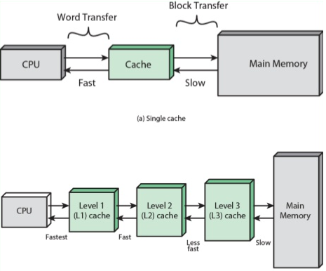
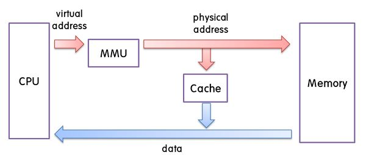
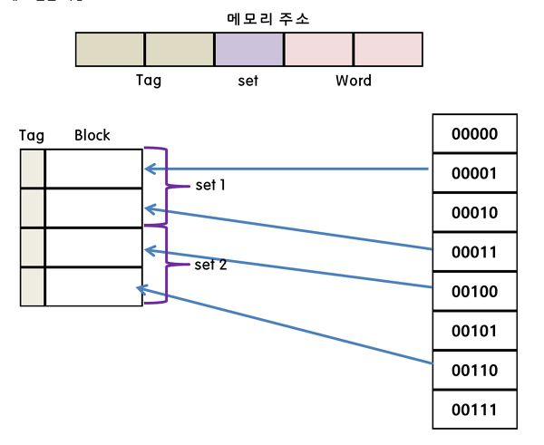

## 캐시의 지역성

### 캐시란?



캐시 메모리는 속도가 빠른 장치와 느린 장치간의 속도차에 따른 병목 현상을 줄이기 위한 범용 메모리이다.  
CPU가 메인메모리에 접근하기 전에 캐시 메모리에서 원하는 데이터 존재 여부를 확인하는데,  
이때 필요한 데이터가 있는 경우 Hit(적중), 없는 경우 Miss(실패)라고 한다. 요청한 데이터를 캐시 메모리에서 찾을 확률은 Hit Ratio(적중률)이라고 한다.  
캐시 메모리의 성능은 적중률에 의해 결정된다.

### 캐시의 종류

캐시 메모리의 작동 순서가 L1에서 순차적으로 데이터를 찾아 L1에 찾고자 하는 데이터가 없다면 순서대로 L2, L3로 올라가며 데이터를 찾는것이다.


- L1 Cache

CPU와 가장 가까운 캐시  
속도를 위해 IC와 DC로 나뉜다.
> IC(Instruction Cache) : 메모리에서 text 영역의 데이터를 다루는 캐시  
> DC(Data Cache) : 메모리에서 text 영역을 제외한 데이터를 다루는 캐시

- L2 Cache

용량이 크다.
크기를 위해 L1 Cache와 같이 나누지 않는다.

- L3 Cache 

멀티 코어 시스템에서 코어가 공유하는 캐시

### 전송 단위

- 워드 (word)

CPU의 기본 처리 단위이며, 블록/라인을 구성하는 기본 단위이다.

- 블록 (block)

메모리를 기준으로 잡은 캐시와의 전송 단위이다.  
캐시 라인과 크기가 같으며, 메모리 블록은 여러 개의 워드로 구성되어 있다.

- 캐시라인 (cache-line)

메모리 블록과 동일한 크기의 캐시 관점의 캐시 - 메모리 간의 전송 단위이다.  
캐시는 여러개의 캐시 라인으로 이어져 있으며 각 라인은 여러개의 워드로 구성되어있다.
> 메인 메모리의 내용을 캐시에 저장하기 위해서 메인메모리의 데이터를 읽어와야 한다.  
이 때, 읽어들이는 최소 단위를 캐시라인(cache-line)이라 하며, 이렇게 읽어들인 데이터는 캐시의 data block을 구성하게 된다.


### 캐시의 쓰기

캐시는 데이터를 읽을 때, 빠르게 읽기 위해서 사용하는 저장공간으로만 알고있다. 하지만 캐시는 쓰기 명령을 수행 할 때도 사용된다.

- write through(동시에 쓰기) : CPU가 데이터를 사용하면 캐시에 저장되는데, 데이터가 캐시 됨과 동시에 메인메모리에 기입하는 방식
    - 즉, 캐시와 메모리 둘다에 업데이트 해버리는 방식
    - 장점 : 캐시와 메모리에 업데이트를 같이하여, 데이터의 일관성을 유지할 수 있어서 안정적
    - 단점 : 데이터에 대한 쓰기를 요청할 때 마다 항상 메인 메모리에 접근해야 하므로 캐시에 의한 접근 시간의 개선이 없어지게 된다.

- wirte back(나중에 쓰기) : 캐시안에 있는 내용을 버릴 때 메인메모리에 기록하는 방식
    - 즉, 데이터를 쓸 때 메모리에는 쓰지 않고 캐시에만 업데이트 하다가 필요할 때에만 메인메모리에 기록하는 방식
    - 장점 : write though보다 훨씬 빠르다.
    - 단점 : 캐시와 메인메모리 데이터가 서로 값이 다른 경우가 발생 할 수 있다.

### 캐시의 지역성 원리

캐시가 효율적으로 동작하려면, 캐시의 적중률을 극대화 시켜야 한다.  
캐시의 적중률을 극대화 시키기 위해서는 캐시에 저장할 데이터가 지역성(Locality)을 가져야한다.  
  
지역성이란, 데이터 접근이 시간적 혹은 공간적으로 가깝게 일어나는 것을 의미한다.
지역성의 전제조건으로 프로그램은 모든 코드나 데이터를 균등하게 Access 하지 않는다는 특성을 기본으로 한다.  
즉, Locality란 기억 장치 내의 정보를 균일하게 Access 하는 것이 아닌 어느 한 순간에 특정 부분을 집중적으로 참조하는 특성인 것이다.  
  
이 데이터 지역성은 대표적으로 시간 지역성(Temporal Locality)과 공간 지역성(Spatial Locality)으로 나뉜다.
- 시간 지역성 : 최근에 참조된 주소의 내용은 곧 다음에 다시 참조되는 특성  
  - 예를 들어 반복문(for, while)을 연상해볼 수 있다.  
  - 반복문을 수행하면 특정 메모리값으로 선언된 부분을 반복하여서 접근하게 된다. 이렇게 방금 전에 접근했던 메모리를 다시 참고하게 될 확률이 높아지는 것이 시간적 지역성이다. 
- 공간 지역성 : 대부분의 실제 프로그램이 참조된 주소와 인접한 주소의 내용이 다시 참조되는 특성  
  - 예를 들어 배열(Array)을 연상해볼 수 있다. 
  - 배열은 일정한 메모리 공간을 순차적으로 할당받아 사용하는 것인데, 공간할당을 연속적으로 받게 된다. 
이 연속적으로 받게 된 메모리를 사용할 때 연속적으로 사용할 확률이 높다.


가로 축은 실행시간이고, 세로축은 메모리 주소다.  
즉, 수평으로 이어진 참조 기록은 긴 시간에 걸쳐 같은 메모리 주소를 참조하여 시간적 지역성을 나타내고, 수직으로 이어진 참조 기록은 같은 시간에 밀접한 메모리 주소들을 참조한 공간 지역성을 나타냅니다.

### 캐시 친화적인 코드

2차원 배열을 통해 캐시 친화적인 코드와 반 캐시 친화적인 코드를 알아보자.  
```
1 2
3 4
```
2차원 배열이 있을경우 메모리에 1, 2, 3, 4 순으로 저장되는데 반복문 탐색을 할 때 1, 3, 2, 4 이런식으로 탐색하게 되면 캐시 친화적인 코드가 아니다.

- 캐시 친화적 코드
```java
for (int i = 0; i < 10; i++) {
    for (int j = 0; j < 10; j++) {
        ... arr[i][j] ...
    }
}
```
- 반 캐시 친화적 코드
```java
for (int i = 0; i < 10; i++) {
    for (int j = 0; j < 10; j++) {
        ... arr[j][i] ...
    }
}
```


### Mapping Function



CPU가 메모리 주소를 사용하여 메모리로 데이터를 받으려고 한다.  
하지만 CPU가 쓰는 주소는 가상 메모리 주소로 메모리 입장에서는 외계어이다.  
  
따라서 중간에 메모리 관리 장치(MMU)가 가운데에서 번역을 하여 메모리가 알 수 있는 물리주소로 변환해준다.  
그리고 캐시에 해당 주소에 대한 데이터가 있는지 확인을 하는데 캐시에 데이터를 저장하는 방식에 따라 물리주소를 다르게 해석할 수 있다.  
즉, Mapping Function이란 캐시에 데이터를 저장하는 여러가지 방법을 의미합니다.

- 직접 매핑 (Direct Mapping)


직접매핑 방식은 캐시에 들어올 때 이미 자리가 정해져있는 방식이다.  

우선 메인 메모리에서 캐시로 데이터를 저장할 때 캐시의 지역성 때문에 한번 퍼낼 때 인접한 곳까지 한꺼번에 캐시 메모리에 저장하고 이 때 단위를 블록(Block)라고 한다.
그리고 캐시는 메인 메모리의 몇번째 블록인지를 알려주는 태그(Tag)도 함께 저장한다.  

> 캐시메모리의 크기는 메인 메모리보다 훨씬 작기 때문에 매핑하기 위해선 주소값 전체를 사용하지 않고 특정 값만 인덱스로 사용하고 다른 값은 태그(Tag)로 사용하게 된다.  
> 태그는 정확한 캐시 메모리 주소를 알기위한 정보이며 인덱스를 결합해서 메인메모리 주소를 찾을 수 있다.

메모리 주소 중에 가장 뒷부분(붉은색)은 블럭의 크기를 의미한다. 지금 블럭의 크기가 4이므로 뒤의 두자리를 사용하여 블럭의 크기를 표현하였다.  

같은 라인에 위치하는 데이터는 파란색 색칠한 영역에 의하여 구별이 가능하다. 예를 들면 메모리의 첫번째 주소 00000과 다섯번째 주소 00100은 캐시내에 같은 위치에 자리 잡고 있어서 구별이 필요한데,
앞의 세자리 000과 001로 구별을 할 수 있다.  

캐시메모리는 메인메모리보다 훨씬 작기 때문에 직접매핑 방식을 사용하게 되면 계속 겹치는 부분은 캐시를 교체해줘야 하기 때문에 적중률이 낮다는 단점이 있다.

- 연관 매핑 (Associative Mapping)


연관 매핑은 직접 매핑의 단점을 보완하기 위해 등장하였다. 캐시에 저장된 데이터들은 메인 메모리의 순서와는 아무런 관련이 없다.  
즉, 빈공간이 있다면 데이터를 넣을 수 있다.  
이와 같은 방식을 사용하기 때문에 캐시를 전부 뒤져서 태그가 같은 데이터가 있는지 확인해야 한다.  
따라서 병렬 검사를 위해 복잡한 회로를 가지고 있는 단점이 있지만 적중률이 높다는 장점이 있다.

- 세트 연관 매핑 (Set Associative Mapping)



직접 매핑의 단순한 회로와 연관 매핑의 적중률 두 개의 장점만을 취하기 위해서 만들어진 방식이다.  
각각의 라인들은 하나의 세트에 속해 있다. 세트번호를 통해 영역을 탐색하므로 연관 매핑의 병렬 탐색을 줄일 수 있다.  
그리고 모든 라인에 연관 매핑처럼 무작위로 위치하여 직접매핑의 단점도 보완하였다.  
세트 안의 라인 수에 따라 n-way 연관 매핑이라고 한다. (위 사진은 2-way 집합 연관 매핑)

> Set : 캐시 라인을 묶어서 세트 집합으로 만든 것  
> Set Associative Mapping 방법은 기본적으로 direct Mapping과 같으나  
> Cache의 Line을 몇개씩 묶어서 Set로 둔다는 점에서 다르다.


    
---
### Reference
https://k39335.tistory.com/38

https://parksb.github.io/article/29.html

https://ssoonidev.tistory.com/35

https://velog.io/@kjh3865/%EC%BA%90%EC%8B%9C-%EB%A9%94%EB%AA%A8%EB%A6%AC-%EC%A0%95%EB%A6%AC

https://wikidocs.net/65523
