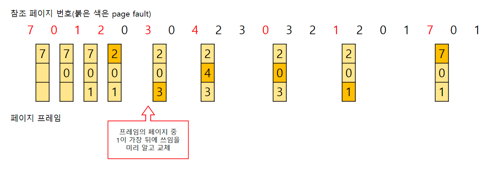

## 페이지 교체 알고리즘

페이징 기법으로 메모리를 관리하는 운영체제에서 필요한 페이지가 메모리에 적재되지 않았을 시(page fault) 어떤 페이지 
프레임을 선택하여 교체 할 것인지 결정하는 방법을 페이지 교체 알고리즘 이라고 한다.

> page fault : CPU가 엑세스한 페이지가 메모리에 없는 경우를 말한다.  
> 페이지 부재 발생 시
> 해당 페이지를 backing store(디스크)에서 메모리로 가져와야 함

 

### 페이지 교체 알고리즘의 종류
- OPT : 앞으로 가장 오랫동안 사용되지 않을 페이지 교체
- FIFO : 가장 먼저 들어와서 가장 오래 있었던 페이지 교체
- LRU : 가장 오랫동안 사용되지 않은 페이지 교체
- LFU : 참조 횟수가 가장 작은 페이지 교체
- MFU : 참조 횟수가 가장 많은 페이지 교체
- NUR : LRU 단점 보완, 두 개의 비트 사용
- SCR : FIFO 단점 보완, 한번 더 기회를 준다.

 

### OPT (OPTimal replacement, 최적 교체)
가장 오랫동안 사용되지 않을 페이지를 교체하는 방법  
가장 이상적이고 효율적인 방법이지만 페이지의 참조 상황을 미리 예측해야해 실현 가능성이 희박하다.

최적 교체 알고리즘은 가장 오랫동안 사용되지 않을 페이지를 알고 교체하기 때문에  
모든 페이지 교체 알고리즘을 통틀어 가장 페이지 교체 수가 적다.

 

### FIFO (First in First Out)
가장 먼저 들어와서 가장 오래 있었던 페이지를 교체하는 기법  

페이지 7의 경우에는 프로세스 초기에 쓰인 후 한동안 쓰이지 않기 때문에 FIFO교체 방식이 큰 문제를 일으키지 않는다.  
페이지 2(9번째)의 경우, 직전 페이지 부재(page4)로 인해 페이지 4와 페이지 2가 교체되고 난 후, 또 다시 페이지 2를 사용하기 위해 교체했던 페이지 2를 다시 불러들였다.

활발하게 사용중인 페이지를 계속해서 교체한다면 페이지 부재율이 높아지고 실행속도가 떨어질 위험이 있다.

> Belady의 이상현상(Belady's anomaly) - 실패가 자주 발생할 경우 page frame을 증가시키면, 즉 사용 가능한 메모리를 늘리면 직관적으로 생각할 때 실패가 감소될 것으로 보이나 실제로는 그렇지 않게 되는 현상이 발생하는 수도 있음을 Belady가 발견하였다.  
> 즉 page frame의 수를 늘렸는데 오히려 실패가 증가하는 수도 있었다. 이를 Belady's anomaly(변이,이상 현상,모순) 또는 FIFO anomaly라 한다.  
> http://melonicedlatte.com/2020/10/13/003700.html

 

### LRU (Least Recently Used)
최근에 가장 오랫동안 사용하지 않은 페이지를 교체하는 기법
각 페이지마다 카운터나 스택을 두어 현 시점에서 가장 오랫동안 사용하지 않은 
페이지를 교체한다.

LRU 알고리즘은 최적 알고리즘보다 페이지 교체 횟수가 높지만 FIFO 알고리즘 보다 효율적이다.  
LRU 알고리즘은 많은 운영체제가 채택하는 알고리즘이며, 좋은 알고리즘이라고 평가 받고있다.  
단점으로는 프로세스가 주기억장치에 접근할때마다 참조된 페이지 시간을 기록해야 하므로 막대한 오버헤드가 발생한다.

 

### LFU (Least Frequently Used)
참조 횟수가 가장 작은 페이지를 교체하는 알고리즘이다. 만약 교체 대상인 
페이지가 여러 개 일 경우, LRU 알고리즘을 따라 가장 오래 사용되지 않은 페이지를 교체한다.

LFU 알고리즘은 초기에 한 페이지를 집중적으로 참조하다가 이후 다시 참조하지 
않는 경우 문제가 될 수 있다.  
앞으로 사용하지 않아도 초기에 사용된 참조횟수가 높아 메모리에 계속 남아있기 때문이다.  
아래의 그림이 예시다.

 

### MFU(Most Frequently Used)
LFU 알고리즘과 반대로, 참조 횟수가 가장 많은 페이지를 교체하는 알고리즘이다.

 

### NUR (Not Used Recently)
LRU와 비슷한 방식으로, 최근에 사용하지 않은 페이지를 교체  
LRU 교체의 단점인 시간 오버헤드를 적게하는 방법  
최근 사용여부를 확인하기 위해 각 페이지마다 두개의 비트(참조비트/변형비트)를 사용  

| 참조비트 | 변형비트 | 교체순서 |
| --- | --- | --- |
| 0 | 0 | 1 |
| 0 | 1 | 2 |
| 1 | 0 | 3 |
| 1 | 1 | 4 |

> 참조비트 : 페이지가 호출되었을 때는 1, 호출되지 않았을 때는 0  
> 변형비트 : 페이지 내용이 변경되었을 때는 1, 변경되지 않았을 때는 0

 

### SCR (Second Chance Replacement)
가장 오래동안 주기억장치에 있던 페이지중 자주 사용되는 페이지의 교체를 방지하기 위한 것으로, FIFO 기법의 단점을 보완하는 기법이다.  
각 페이지 마다 참조비트를 두고, FIFO 기법을 이용하여 페이지 교체 수행중 참조비트가 0일 경우에는 교체하고,  
참조비트가 1일 경우에는 참조비트를 0으로 지정한 후 FIFO 리스트의 맨 마지막으로 피드백 시켜 다음 순서를 기다리게 한다.

 

### 교체 방식
- Global 교체  
    메모리 상의 모든 프로세스 페이지에 대해 교체하는 방식
  
- Local 교체  
    메모리 상의 자기 프로세스 페이지에서만 교체하는 방식
  
다중 프로그래밍의 경우, 메인 메모리에 다양한 프로세스가 동시에 올라갈 수 있다. 따라서, 다양한 프로세스의 페이지가 메모리에 존재한다.  
  
전체를 기준으로 페이지를 교체하는것이 더 효율적이다. 나중에 교체할 때 각각 모두 교체를 진행해야 하므로 비효율적이다.

---
### Reference
https://liveyourit.tistory.com/235

https://medium.com/pocs/%ED%8E%98%EC%9D%B4%EC%A7%80-%EA%B5%90%EC%B2%B4-page-replacement-%EC%95%8C%EA%B3%A0%EB%A6%AC%EC%A6%98-650d58ae266b

https://doh-an.tistory.com/28

https://jypthemiracle.medium.com/%EA%B0%80%EC%83%81-%EB%A9%94%EB%AA%A8%EB%A6%AC%EC%97%90-%EB%8C%80%ED%95%9C-%EC%A7%A7%EC%9D%80-%EB%A9%94%EB%AA%A8-9aa54c546f04
